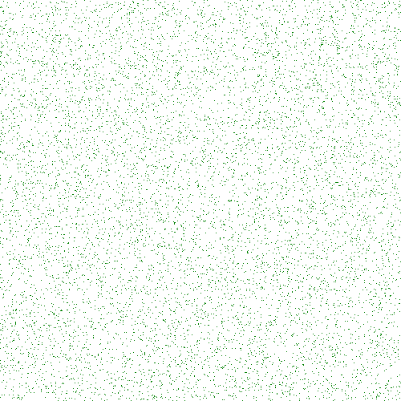

# PHP|GmagickDraw point()函数

> Original: [https://www.geeksforgeeks.org/php-gmagickdraw-point-function/](https://www.geeksforgeeks.org/php-gmagickdraw-point-function/)

GmagickDraw：：point()函数是 PHP 中的一个内置函数，用于绘制点。 此函数使用指定坐标处的当前笔划颜色和笔划粗细。

**语法：**

```php
*public* GmagickDraw::point( $x, $y )
```

*
**参数：**此函数接受上述两个参数，如下所述：

*   **$x：**此参数取 x 坐标的值。
*   **$y：**此参数采用 y 坐标的值。

**返回值：**此函数成功时返回 GmagickDraw 对象。

**错误/异常：**此函数在出错时引发 GmagickException。

下面的程序演示了 PHP 中的*GmagickDraw：：point()*函数：

**程序 1：**

```php
<?php 

// Create a GmagickDraw object 
$draw = new GmagickDraw();  

// Set the color
$draw->setFillColor('Green'); 

// Set the width and height of image 
$draw->setStrokeWidth(1170); 
$draw->setFontSize(72); 

// Use loop to draw 10000 points in given area 

for ($x = 0; $x < 10000; $x++) { 
    $draw->point(rand(0, 500), rand(0, 500)); 
} 

$gmagick = new Gmagick(); 
$gmagick->newImage(500, 500, 'White'); 
$gmagick->setImageFormat("png"); 

// Use of drawimage function
$gmagick->drawImage($draw); 

// Display the output image 
header("Content-Type: image/png"); 
echo $gmagick->getImageBlob(); 
?> 
```

**输出：**


**程序 2：**

```php
<?php 

// Create a GmagickDraw object 
$draw = new ImagickDraw();  

// Set the color

// Set the width and height of image 
$draw->setStrokeWidth(7000); 
$draw->setFontSize(72); 

// Function to draw point  
for ($x = 0; $x < 10000; $x++) { 
$draw->setFillColor('green'); 
    $draw->point(rand(0, 900), rand(0, 500)); 
} 

$draw->setFontSize(40); 

$gmagick = new Imagick(); 
$gmagick->newImage(900, 500, 'White'); 
$gmagick->setImageFormat("png"); 

// Annotate image
$gmagick->annotateImage($draw, 5, 120, 0, 
        'GeeksforGeeks: A computer science portal'); 

$gmagick->annotateImage($draw, 5, 220, 0,
                        'sarthak_ishu11'); 

// Use of drawimage function
$gmagick->drawImage($draw); 

// Display the output image 
header("Content-Type: image/png"); 
echo $gmagick->getImageBlob(); 
?> 
```

**输出：**


**引用：**[http://php.net/manual/en/gmagickdraw.point.php](http://php.net/manual/en/gmagickdraw.point.php)