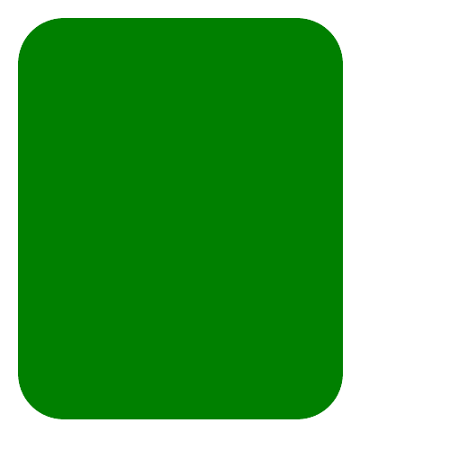

# PHP|GmagickDraw round Rectangle()函数

> Original: [https://www.geeksforgeeks.org/php-gmagickdraw-roundrectangle-function/](https://www.geeksforgeeks.org/php-gmagickdraw-roundrectangle-function/)

GmagickDraw：：round rectangle()函数是 PHP 中的一个内置函数，用于绘制圆角矩形。

**语法：**

```
*public* GmagickDraw::rectangle( $x1, $y1, $x2, $y2, $rx, $ry)
```

*
**参数：**此函数接受上述四个参数，如下所述：

*   **$x1：**此参数取左上角的 x 坐标值。
*   **$y1：**此参数取左上角的 y 坐标值。
*   **$x2：**此参数取右下角的 x 坐标值。
*   **$y2：**此参数取右下角的 y 坐标值。
*   **$ry：**此参数取垂直方向的拐角半径值。
*   **$rx：**该参数取水平方向角点半径的值。

**返回值：**此函数成功时返回 GmagickDraw 对象。

**错误/异常：**此函数在出错时引发 GmagickException。

下面的程序演示了 PHP 中的*GmagickDraw：：round Rectangle()*函数：

**程序 1：**

```
<?php 

// Create a GmagickDraw object 
$draw = new GmagickDraw();  

// Set the color
$draw->setFillColor('Green'); 

// Set the width and height of image 
$draw->setStrokeWidth(7); 
$draw->setFontSize(72); 

// Function to draw roundrectangle  
$draw->roundrectangle(20, 20, 380, 465, 50, 50);

$gmagick = new Gmagick(); 
$gmagick->newImage(500, 500, 'White'); 
$gmagick->setImageFormat("png"); 

// Use of drawimage function
$gmagick->drawImage($draw); 

// Display the output image 
header("Content-Type: image/png"); 
echo $gmagick->getImageBlob(); 
?> 
```

**输出：**


**程序 2：**

```
<?php 

// Create a GmagickDraw object 
$draw = new ImagickDraw();  

// Set the color
$draw->setFillColor('Lightgreen'); 

// Set the width and height of image 
$draw->setStrokeWidth(7); 
$draw->setFontSize(72); 

// Function to draw roundrectangle  
$draw->roundrectangle(20, 20, 880, 465, 50, 50);
$draw->setFontSize(40); 
$draw->setFillColor('Green');  
$gmagick = new Imagick(); 
$gmagick->newImage(900, 500, 'White'); 
$gmagick->setImageFormat("png"); 

// Use of drawimage function
$gmagick->drawImage($draw); 

// Annotate Image
$gmagick->annotateImage($draw, 5, 120, 0,  
    '  GeeksforGeeks: A computer science portal'); 

$gmagick->annotateImage($draw, 5, 220, 0,  
                        '  sarthak_ishu11'); 

// Display the output image 
header("Content-Type: image/png"); 
echo $gmagick->getImageBlob(); 
?> 
```

**输出：**


**引用：**[http://php.net/manual/en/gmagickdraw.roundrectangle.php](http://php.net/manual/en/gmagickdraw.roundrectangle.php)