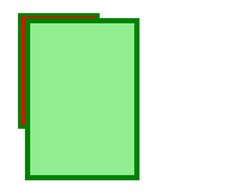
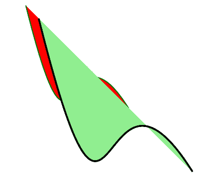

# PHP|GmagickDraw scale()函数

> Original: [https://www.geeksforgeeks.org/php-gmagickdraw-scale-function/](https://www.geeksforgeeks.org/php-gmagickdraw-scale-function/)

GmagickDraw：：Scale()函数是 PHP 中的一个内置函数，用于设置缩放因子，并将其应用于当前坐标空间的水平和垂直方向。
**语法：**和

```
*public* GmagickDraw::scale( $x, $y ) : GmagickDraw
```

**参数：**此函数接受上述两个参数，如下所述：

*   **$x：**此参数用于保存水平系数的值。
*   **$y：**此参数用于保存垂直系数的值。

**返回值：**此函数成功时返回 GmagickDraw 对象。
以下程序说明 PHP：
**程序 1：**和
中的 GmagickDraw：：Scale()函数

## PHP

```
<?php

// require_once('path/vendor/autoload.php');

// Create a GmagickDraw object

$draw = new \GmagickDraw ();

// Set the Stroke Color
$draw->setStrokeColor('Green');

// Set the Fill Color
$draw->setFillColor('Red');

// Set the stroke width
$draw->setStrokeWidth(7);

// Draw the rectangle
$draw->rectangle(40, 30, 200, 260);

// Set the scale
$draw->scale(1.4, 1.4);

// Set the fill color
$draw->setFillColor('lightgreen');

// Draw the rectangle
$draw->rectangle(40, 30, 200, 260);

// Create an Gmagick object
$image = new \Gmagick();

// Set the image dimensions
$image->newImage(800, 400, 'White');

// Set the image format
$image->setImageFormat("png");

// Draw the image
$image->drawImage($draw);
header("Content-Type: image/png");

// Display the image
echo $image->getImageBlob();
?>
```

发帖主题：Re：Колибри0.7.8.0



**程序 2：**和

## PHP

```
<?php

// require_once('path/vendor/autoload.php');

// Create an Gmagick Draw object
$draw = new \GmagickDraw();

// Set the stroke color
$strokeColor = new \GmagickPixel('Green');

// Set the fill color
$fillColor = new \GmagickPixel('Red');

// Set the stroke opacity
$draw->setStrokeOpacity(1);

// Set the stroke color
$draw->setStrokeColor('Green');

// Set the Fill Color
$draw->setFillColor('Red');

// Set the stroke width
$draw->setStrokeWidth(2);

$smoothPointsSet = [
        [
            ['x' => 10.0 * 5, 'y' => 10.0 * 5],
            ['x' => 30.0 * 5, 'y' => 90.0 * 5],
            ['x' => 25.0 * 5, 'y' => 10.0 * 5],
            ['x' => 50.0 * 5, 'y' => 50.0 * 5],
        ]
    ];

foreach ($smoothPointsSet as $points) {
    $draw->bezier($points);
}

// Set the stroke color
$draw->setStrokeColor('black');

// Set the fill color
$draw->setFillColor('lightgreen');

// Set the scale
$draw->scale(1.5, 1.5);

    foreach ($smoothPointsSet as $points) {
        $draw->bezier($points);
    }

// Create an gmagick object
$gmagick = new \Gmagick();

// Set the image dimensions
$gmagick ->newImage(400, 500, 'White');

// Set the image format
$gmagick ->setImageFormat("png");

// Draw the image
$gmagick ->drawImage($draw);
header("Content-Type: image/png");

// Display the image
echo $gmagick ->getImageBlob();
?>
```

发帖主题：Re：Колибри0.7.8.0



**引用：**[http://php.net/manual/en/gmagickdraw.scale.php](http://php.net/manual/en/gmagickdraw.scale.php)