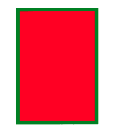

# PHP|GmagickDraw setstrokecolor()函数

> Original: [https://www.geeksforgeeks.org/php-gmagickdraw-setstrokecolor-function/](https://www.geeksforgeeks.org/php-gmagickdraw-setstrokecolor-function/)

GmagickDraw：：setstrokecolor()函数是 PHP 中的一个内置函数，用于设置用于描边对象轮廓的颜色。

**语法：**

```
*public* GmagickDraw::setstrokecolor( $color ) : GmagickDraw
```

**参数：**此函数接受用于保存颜色值的单个参数*$color*。

**返回值：**此函数在成功时返回 GmagickDraw 对象。

下面的程序演示了 PHP 中的 GmagickDraw：：setstrokecolor()函数：

**程序 1：**

```
<?php

// require_once('path/vendor/autoload.php');

// Create an GmagickDraw object
$draw = new \GmagickDraw ();

// Set stroke opacity
$draw->setStrokeOpacity(1);

// Set stroke color
$draw->setStrokeColor('Black');

// Set stroke opacity
$draw->setStrokeOpacity(0.8);

// Set stroke width
$draw->setStrokeWidth(10);

// Set Stroke Line Join
$draw->setStrokeLineJoin(Gmagick::LINEJOIN_ROUND);

// Set Fill Color
$draw->setFillColor('lightgreen');

// Set Stroke Miter Limit
$draw->setStrokeMiterLimit(40 * 12);

$points = [
        ['x' => 50 * 6, 'y' => 10 * 5],
        ['x' => 20 * 7, 'y' => 30 * 5], 
        ['x' => 60 * 8, 'y' => 50 * 5], 
        ['x' => 70 * 3, 'y' => 15 * 5],
    ];

// Draw a polygon
$draw->polygon($points);

// Create a new Gmagick object
$image = new \Gmagick();

// Set image dimensions
$image->newImage(500, 300, 'white');

// Set the image format 
$image->setImageFormat("png");

// Draw the image
$image->drawImage($draw);
header("Content-Type: image/png");

// Display the image
echo $image->getImageBlob();
?>
```

**输出：**


**程序 2：**

```
<?php

// require_once('path/vendor/autoload.php');

// Create an GmagickDraw object 
$draw = new \GmagickDraw ();

// Set the stroke color
$draw->setStrokeColor('Green');

// Set Fill Color
$draw->setFillColor('Red');

// Set the stroke width
$draw->setStrokeWidth(7);

// Draw the rectangle
$draw->rectangle(40, 30, 200, 260);

// Create new Gmagick object 
$image = new \Gmagick();

// Set the image dimension
$image->newImage(300, 300, 'White');

// Set the image format
$image->setImageFormat("png");

// Draw the image
$image->drawImage($draw);
header("Content-Type: image/png");

// Display the image
echo $image->getImageBlob();
?>
```

**输出：**


**引用：**[http://php.net/manual/en/gmagickdraw.setstrokecolor.php](http://php.net/manual/en/gmagickdraw.setstrokecolor.php)