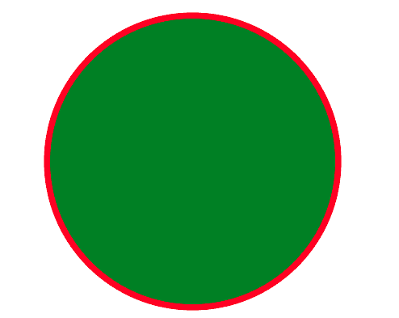
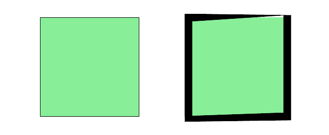

# PHP|GmagickDraw setstrokewidth()函数

> Original: [https://www.geeksforgeeks.org/php-gmagickdraw-setstrokewidth-function/](https://www.geeksforgeeks.org/php-gmagickdraw-setstrokewidth-function/)

GmagickDraw：：setstrokewidth()函数是 PHP 中的一个内置函数，用于设置用于绘制对象轮廓的笔划宽度。

**语法：**

```php
*public* GmagickDraw::setstrokewidth( $stroke_width ) : GmagickDraw
```

**参数：**此函数接受单个参数*$kes_width*，该参数用于保存笔划宽度的值。 它是浮点型的值。

**返回值：**此函数在成功时返回 GmagickDraw 对象。

下面的程序演示了 PHP 中的 GmagickDraw：：setstrokewidth()函数：

**程序 1：**

```php
<?php

// Create new Gmagick object 
$draw = new \GmagickDraw ();

// Set the stroke Color
$draw->setStrokeColor('Red');

// Set the image filled color 
$draw->setFillColor('Green');

// Set the Stroke Width
$draw->setStrokeWidth(7);

// Draw the Circle
$draw->circle(250, 250, 100, 150);

// Create new Gmagick Object
$gmagick = new \Gmagick ();

// Set the dimensions of image
$gmagick ->newImage(500, 500, 'White');

// Set the image format 
$gmagick ->setImageFormat("png");

// Draw the image 
$gmagick ->drawImage($draw);

header("Content-Type: image/png");

// Display the image
echo $gmagick ->getImageBlob();
?>
```

**输出：**


**程序 2：**

```php
<?php
// Create new Gmagick Object 
$draw = new GmagickDraw ();

// Set the stroke color
$draw->setStrokeColor('black');

// Set the image filled color 
$draw->setFillColor('lightgreen');

// Set the Stroke Width
$draw->setStrokeWidth(0);

// Draw the rectangle
$draw->rectangle(100, 100, 300, 300);

// Set Stroke Width
$draw->setStrokeWidth(15);

// Draw the rectangle
$draw->rectangle(400, 100, 600, 300);

// Create new Gmagick Object 
$gmagick = new \Gmagick ();

// Set the dimensions of image
$gmagick ->newImage(800, 500, 'White');

// Set the image format
$gmagick ->setImageFormat("png");

// Draw the image 
$gmagick ->drawImage($draw);
header("Content-Type: image/png");

// Display the image 
echo $gmagick ->getImageBlob();
?>
```

**输出：**


**引用：**[http://php.net/manual/en/gmagickdraw.setstrokewidth.php](http://php.net/manual/en/gmagickdraw.setstrokewidth.php)