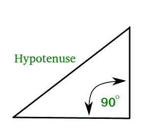

# PHP|downt()函数

> Original: [https://www.geeksforgeeks.org/php-hypot-function/](https://www.geeksforgeeks.org/php-hypot-function/)

supt()函数是 PHP 中的内置数学函数，返回传递的参数平方和的平方根。 它找出斜边，斜边是直角三角形中最长的边。 它是通过公式计算的：

其中 x 和 y 是三角形的另外两条边。


**语法：**

```
hypot(x,y);

```

**使用的参数**：

*   **x**：第一条边的长度。
*   **y**：第二条边的长度。

**返回类型：**supt(x，y)的返回类型是 Float，它返回作为参数传递给它的值的平方根。

例如：

```
Input : x=3, y=4
Output :5

Input :x=9, y=10
Output : 13.453624047074

```

下面的程序演示了 PHP 中 supt()函数的工作原理：

```
<?php
    // PHP code

    // Calculating the value of hypotenuse 
    // With sides = 3,4
    $hypotenuse  = hypot(3,4);
    print_r($hypotenuse);

    // New Line
    print_r("\n");

    // Calculating the value of hypotenuse 
    // With sides = 4,6
    $hypotenuse = hypot(4,6);
    print_r($hypotenuse);
?>
```

产出：

```
5
7.211102550928

```

**相关文章**：[C++中的 demt()](https://www.geeksforgeeks.org/hypot-hypotf-hypotl-c/)