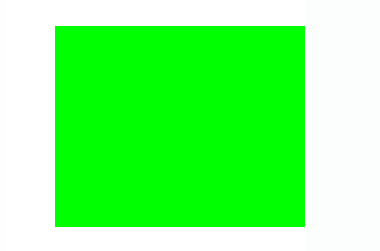

# PHP|imagelphablating()函数

> Original: [https://www.geeksforgeeks.org/php-imagealphablending-function/](https://www.geeksforgeeks.org/php-imagealphablending-function/)

函数的作用是：**imagelphablating()**是 PHP 的内置函数，用于设置图像的混合模式。 此功能允许使用两种不同的模式(混合模式和非混合模式)来绘制真彩色图像。 绘制使用过的调色板图像时，混合模式不可用。

**语法：**

```php
*bool* imagealphablending( $image, $blendmode )
```

**参数：**此函数接受上述两个参数，如下所述：

*   **$image：**它由图像创建函数之一返回，如 imagecreatetruecolor()。 它用于创建图像的大小。
*   **$blendmode：**该参数用于检查混合模式是否启用。 对于真彩色图像，默认值为 True，否则为 False。

**返回值：**此函数成功时返回 True，失败时返回 False。

下面的程序说明了 PHP 中的**imagelphablating()**函数：

**程序 1：**

```php
<?php

// Create an image of given size
$image = imagecreatetruecolor(300, 500);

// Set alphablending to on
imagealphablending($image, true);

// Set the background color of image. 
$background_color = imagecolorallocate($image, 255, 255, 255); 

// Fill background with above selected color. 
imagefill($image, 0, 0, $background_color); 

// Draw a square of given size
imagefilledrectangle($image, 50, 50, 450, 250, imagecolorallocate($image, 0, 255, 0));

// Output image
header('Content-Type: image/png');

imagepng($image);
imagedestroy($image);
?>
```

**输出：**


**程序 2：**

```php
<?php

// Create an image from png
$image = imagecreatefrompng( 
'https://media.geeksforgeeks.org/wp-content/uploads/geeksforgeeks-9.png'); 

// Set alphablending to image
imagealphablending($image, true);

// Create color of image
$green = imagecolorallocate($image, 0, 255, 0); 

// Create rectangle
imagerectangle($image, 5, 10, 660, 100, $green);

// Output image
header('Content-Type: image/png');

imagepng($image);
imagedestroy($image);
?>
```

**输出：**


**引用：**[http://php.net/manual/en/function.imagealphablending.php](http://php.net/manual/en/function.imagealphablending.php)