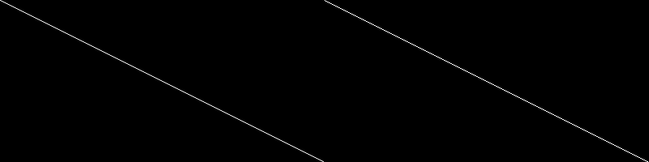

# PHP|imageantialias()函数

> Original: [https://www.geeksforgeeks.org/php-imageantialias-function/](https://www.geeksforgeeks.org/php-imageantialias-function/)

Imageantialias()函数是 PHP 中的内置函数，用于检查是否使用了抗锯齿函数。 此功能激活线条和有线多边形的快速绘制抗锯齿方法。 它只适用于真彩色图像。

**语法：**

```php
*bool* imageantialias( $image, $enabled )
```

**参数：**此函数接受上述两个参数，如下所述：

*   **$image：**一个图像资源，由某个图像创建函数返回，如 imagecreatetruecolor()。
*   **$Enabled：**该参数用于检查是否启用抗锯齿。

**返回值：**此函数成功时返回 True，失败时返回 False。

**注意：**现在可以使用 imageantialias()函数。 仅当 PHP 针对 GD 库的版本编译时才可用。

下面的程序演示了 imageantialias()函数。

**程序 1：**

```php
<?php

// Function to create image of given size
$antialias_img = imagecreatetruecolor(800, 200);
$normal_img = imagecreatetruecolor(400, 200);

// Switch antialiasing on for one image
imageantialias($antialias_img, true);

// Allocate the color for image
$white = imagecolorallocate($normal_img, 255, 255, 255);
$white_anti_aliased = imagecolorallocate($antialias_img, 255, 255, 255);

// Draw two lines, one with antialiasing enabled
imageline($normal_img, 0, 0, 400, 200, $white);
imageline($antialias_img, 0, 0, 400, 200, $white_anti_aliased);

// Merge the two images side by side for output
imagecopymerge($antialias_img, $normal_img, 400, 0, 0, 0, 400, 200, 200);

// Output image
header('Content-type: image/png');

imagepng($antialias_img);
imagedestroy($antialias_img);
imagedestroy($normal_img_img);
?>
```

**输出：**


**引用：**[http://php.net/manual/en/function.imageantialias.php](http://php.net/manual/en/function.imageantialias.php)