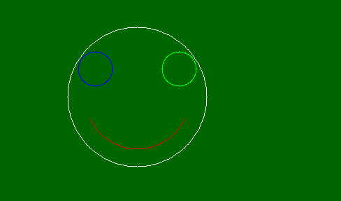
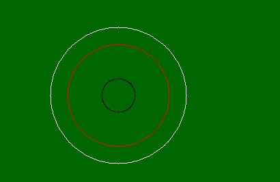

# PHP|imagearc()函数

> Original: [https://www.geeksforgeeks.org/php-imagearc-function/](https://www.geeksforgeeks.org/php-imagearc-function/)

**imagearc()**函数是 PHP 中的一个内置函数，用于创建以给定坐标为中心的圆弧。 此函数成功时返回 TRUE，失败时返回 FALSE。

**语法：**

```php
bool imagearc( $image, $cx, $cy, $width, $height, $start, $end, 
$color )
```

**参数：**此函数接受上述 8 个参数，如下所述：

*   **$image：**它由图像创建函数之一返回，如 imagecreatetruecolor()。 它用于创建图像的大小。
*   **$cx：**用于设置中心的 x 坐标。
*   **$cy：**用于设置中心的 y 坐标。
*   **$width：**圆弧的宽度。
*   **$Height：**圆弧的高度。
*   **$start：**它用于设置圆弧起点角度(以度为单位)。
*   **$end：**它用于设置圆弧末端角度，单位为度。 0°位于三点位置，圆弧是顺时针绘制的。
*   **$color：**它设置图像的颜色。 由 imagecolorallocation()函数创建的颜色标识符。

**返回值：**此函数成功时返回 TRUE，失败时返回 FALSE。

下面的程序演示了 PHP 中的**imagearc()**函数。

**程序 1：**

```php
<?php

// It create the size of image or blank image.
$image_size = imagecreatetruecolor(500, 300);

// Set the background color of image.
$bg = imagecolorallocate($image_size, 0, 103, 0);

// Fill background with above selected color.
imagefill($image_size, 0, 0, $bg); 

// Set the colors of image
$white_color = imagecolorallocate($image_size, 255, 255, 255);
$red_color = imagecolorallocate($image_size, 255, 0, 0);
$green_color = imagecolorallocate($image_size, 0, 255, 0);
$blue_color = imagecolorallocate($image_size, 0, 0, 255);

// Draw the circle
imagearc($image_size, 200, 150, 200, 200, 0, 360, $white_color);
imagearc($image_size, 200, 150, 150, 150, 25, 155, $red_color);
imagearc($image_size, 260, 110, 50, 50, 0, 360, $green_color);
imagearc($image_size, 140, 110, 50, 50, 0, 360, $blue_color);

// Output image in the browser
header("Content-type: image/png");
imagepng($image_size);

// Free memory
imagedestroy($image_size);

?>
```

**输出：**


**程序 2：**

```php
<?php

// It create the size of image or blank image.
$image_size = imagecreatetruecolor(500, 300);

// Set the background color of image.
$bg = imagecolorallocate($image_size, 0, 102, 0);

// Fill background with above selected color.
imagefill($image_size, 0, 0, $bg); 

// Set the colors of image
$white_color = imagecolorallocate($image_size, 255, 255, 255);
$red_color = imagecolorallocate($image_size, 255, 0, 0);
$black_color = imagecolorallocate($image_size, 0, 0, 0);

// Draw the arc circle image
imagearc($image_size, 200, 150, 200, 200, 0, 360, $white_color);
imagearc($image_size, 200, 150, 150, 150, 0, 360, $red_color);
imagearc($image_size, 200, 150, 50, 50, 0, 360, $black_color);

// Output image in the browser
header("Content-type: image/png");
imagepng($image_size);

// Free memory
imagedestroy($image_size);

?>
```

**输出：**


**相关文章：**

*   [PHP|imagepolygon()函数](https://www.geeksforgeeks.org/php-imagepolygon-function/)
*   [PHP|imagefilledellipse()函数](https://www.geeksforgeeks.org/php-imagefilledellipse-function/)
*   [PHP|imagefilledpolygon()函数](https://www.geeksforgeeks.org/php-imagefilledpolygon-function/)

**引用：**[http://php.net/manual/en/function.imagearc.php](http://php.net/manual/en/function.imagearc.php)