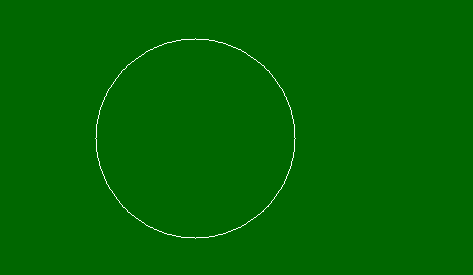

# PHP|图像颜色分配()函数

> Original: [https://www.geeksforgeeks.org/php-imagecolorallocate-function/](https://www.geeksforgeeks.org/php-imagecolorallocate-function/)

函数的作用是：**imagecolorallocation()**是 PHP 中的内置函数，用于设置图像中的颜色。 此函数返回以 RGB 格式给出的颜色。

**语法：**

```php
*int* imagecolorallocate ( $image, $red, $green, $blue )
```

**参数：**此函数接受上述四个参数，如下所述：

*   **$image：**它由图像创建函数之一返回，如 imagecreatetruecolor()。 它用于创建图像的大小。
*   **$red：**该参数用于设置红色分量的值。
*   **$green：**该参数用于设置绿色分量的值。
*   **$BLUE：**该参数用于设置蓝色分量的值。

**返回值：**如果颜色分配成功，则此函数返回颜色标识符；如果颜色分配失败，则返回 False。

下面的程序演示了 PHP 中的**imagecolorallocation()**函数。

**程序 1：**

```php
<?php

// It create the size of image or blank image.
$image_size = imagecreatetruecolor(500, 300);

// Set the background color of image using
// imagecolorallocate() function.
$bg = imagecolorallocate($image_size, 0, 103, 0);

// Fill background with above selected color.
imagefill($image_size, 0, 0, $bg); 

// output image in the browser
header("Content-type: image/png");
imagepng($image_size);

// free memory
imagedestroy($image_size);

?>
```

**输出：**


**程序 2：**

```php
<?php

// It create the size of image or blank image.
$image_size = imagecreatetruecolor(500, 300);

// Set the background color of image.
$bg = imagecolorallocate($image_size, 0, 103, 0);

// Fill background with above selected color.
imagefill($image_size, 0, 0, $bg); 

// Set the colors of image
$white_color = imagecolorallocate($image_size, 255, 255, 255);

// Draw a circle
imagearc($image_size, 200, 150, 200, 200,  0, 360, $white_color);
// output image in the browser
header("Content-type: image/png");
imagepng($image_size);

// free memory
imagedestroy($image_size);

?>
```

**输出：**


**相关文章：**

*   [PHP|ImageEllse()函数](https://www.geeksforgeeks.org/php-imageellipse-function/)
*   [PHP|imagearc()函数](https://www.geeksforgeeks.org/php-imagearc-function/)
*   [PHP|imagefilledellipse()函数](https://www.geeksforgeeks.org/php-imagefilledellipse-function/)

**引用：**[http://php.net/manual/en/function.imagecolorallocate.php](http://php.net/manual/en/function.imagecolorallocate.php)