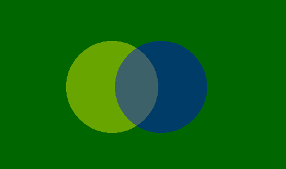

# PHP|imagecolorallocatealpha()函数

> Original: [https://www.geeksforgeeks.org/php-imagecolorallocatealpha-function/](https://www.geeksforgeeks.org/php-imagecolorallocatealpha-function/)

**imagecolorallocatealpha()**函数是 PHP 中的一个内置函数，用于为图像分配颜色。 此函数与**imagecolorallocation()**函数相同，但增加了透明度参数$alpha。 此函数接受五个参数，失败时返回 TRUE 或 FALSE 的颜色标识符。

**语法：**

```
*int* imagecolorallocatealpha ( $image, $red, $green, $blue, $alpha )
```

**参数：**此函数接受上述五个参数，如下所述：

*   **$image：**它由图像创建函数之一返回，如 imagecreatetruecolor()。 它用于创建图像的大小。
*   **$red：**该参数用于设置红色分量的值。
*   **$green：**该参数用于设置绿色分量的值。
*   **$BLUE：**该参数用于设置蓝色分量的值。
*   **$alpha：**此参数用于设置图像的透明度。 $alpha 的值介于 0 到 127 之间，其中 0 表示完全不透明，127 表示完全透明。

**返回值：**如果颜色分配成功，则此函数返回颜色标识符；如果颜色分配失败，则返回 False。

**异常：**5.1.3 或更高版本如果分配失败则返回 FALSE，否则先前返回-1。

以下程序说明了 PHP 中的**imagecolorallocatealpha()**函数：

**程序 1：**

```
<?php

// It create the size of image or blank image.
$image = imagecreatetruecolor(500, 300);

// Set the background color of image.
$bg = imagecolorallocate($image, 0, 103, 0);

// Fill background with above selected color.
imagefill($image, 0, 0, $bg); 

// allocate colors with alpha values
$yellow = imagecolorallocatealpha($image, 255, 255, 0, 75);
$red    = imagecolorallocatealpha($image, 255, 0, 0, 75);
$blue   = imagecolorallocatealpha($image, 0, 0, 255, 75);

// Drawing filled circle
imagefilledellipse($image, 200, 100, 150, 150, $yellow);
imagefilledellipse($image, 275, 100, 150, 150, $red);
imagefilledellipse($image, 240, 180, 150, 150, $blue);

//output a correct header!
header('Content-Type: image/png');

//output the result
imagepng($image);
imagedestroy($image);
?>
```

**输出：**


**程序 2：**

```
<?php

// It create the size of image or blank image.
$image = imagecreatetruecolor(500, 300);

// Set the background color of image.
$bg = imagecolorallocate($image, 0, 103, 0);

// Fill background with above selected color.
imagefill($image, 0, 0, $bg); 

// allocate colors with alpha values
$yellow = imagecolorallocatealpha($image, 255, 255, 0, 75);
$blue   = imagecolorallocatealpha($image, 0, 0, 255, 75);

// Drawing filled circle
imagefilledellipse($image, 200, 150, 150, 150, $yellow);
imagefilledellipse($image, 280, 150, 150, 150, $blue);

//output a correct header!
header('Content-Type: image/png');

//output the result
imagepng($image);
imagedestroy($image);
?>
```

**输出：**


**相关文章：**

*   [PHP|imagepolygon()函数](https://www.geeksforgeeks.org/php-imagepolygon-function/)
*   [PHP|imagechar()函数](https://www.geeksforgeeks.org/php-imagechar-function/)
*   [PHP|ImageEllse()函数](https://www.geeksforgeeks.org/php-imageellipse-function/)

**引用：**[http://php.net/manual/en/function.imagecolorallocatealpha.php](http://php.net/manual/en/function.imagecolorallocatealpha.php)