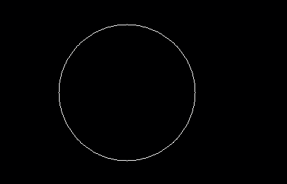

# PHP|imagecolordelocate()函数

> Original: [https://www.geeksforgeeks.org/php-imagecolordeallocate-function/](https://www.geeksforgeeks.org/php-imagecolordeallocate-function/)

函数**的作用是：**是 PHP 中的一个内置函数，用于为图像取消分配由 imagecoloralallocatealpha()函数创建的颜色。

**语法：**

```php
*bool* imagecolordeallocate( $image, $color )
```

**参数：**此函数接受上述两个参数，如下所述：

*   **$image：**它由图像创建函数之一返回，如 imagecreatetruecolor()。 它用于创建图像的大小。
*   **$COLOR：**此参数保存颜色标识符。

**返回值：**此函数成功时返回 True，失败时返回 False。

下面的程序演示了 PHP 中的 imagecolordelocate()函数：

**程序 1：**

```php
<?php 

// It create the size of image or blank image. 
$image_size = imagecreatetruecolor(500, 300); 

// Set the background color of image using 
// imagecolorallocate() function. 
$bg = imagecolorallocate($image_size, 0, 103, 0); 

// Use imagecolordeallocate() function to
// deallocate the color
$bg = imagecolordeallocate($image_size, $bg);

// Fill background with above selected color. 
imagefill($image_size, 0, 0, $bg); 

// Output image in the browser 
header("Content-type: image/png"); 
imagepng($image_size); 

// free memory 
imagedestroy($image_size); 

?> 
```

**输出：**


**程序 2：**

```php
<?php 

// It create the size of image or blank image. 
$image_size = imagecreatetruecolor(500, 300); 

// Set the background color of image. 
$bg = imagecolorallocate($image_size, 0, 103, 0); 

// Use imagecolordeallocate() function to
// deallocate the color
$bg = imagecolordeallocate($image_size, $bg); 

// Fill background with above selected color. 
imagefill($image_size, 0, 0, $bg); 

// Set the colors of image 
$white_color = imagecolorallocate($image_size, 255, 255, 255); 

// Draw a circle 
imagearc($image_size, 200, 150, 200, 200, 0, 360, $white_color); 

// Output image in the browser 
header("Content-type: image/png"); 
imagepng($image_size); 

?>
```

**输出：**


**引用：**[https://www.php.net/manual/en/function.imagecolordeallocate.php](https://www.php.net/manual/en/function.imagecolordeallocate.php)