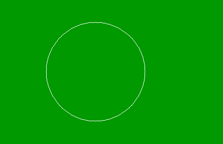

# PHP|imagecolorset()函数

> Original: [https://www.geeksforgeeks.org/php-imagecolorset-function/](https://www.geeksforgeeks.org/php-imagecolorset-function/)

**imagecolorset()**函数是 PHP 中的内置函数，用于设置指定调色板索引的颜色。 它用于将调色板中的索引指定为指定的颜色。 要执行实际的填充，在没有开销的调色板图像中创建类似填充的效果是很有用的。

**语法：**

```php
*void* imagecolorset ( $image, $index, $red, $green, $blue, $alpha )
```

**参数：**此函数接受上述 6 个参数，如下所述：

*   **$image：**它由一个图像创建函数返回，例如**imagecreatetruecolor()**。 它用于创建图像的大小。
*   **$index：**此参数是调色板图像中的索引值。
*   **$red：**该参数用于设置红色分量的值。
*   **$green：**该参数用于设置绿色分量的值。
*   **$BLUE：**该参数用于设置蓝色分量的值。
*   **$alpha：**此参数用于设置图像的透明度。 $alpha 的值介于 0 到 127 之间，其中 0 表示完全不透明，127 表示完全透明。

**返回值：**此函数不返回任何值。

以下程序说明了 PHP 中的**imagecolorset()**函数：

**程序 1：**

```php
<?php

// Create an image of given size
$image = imagecreate(500, 300);

// Set the background 
imagecolorallocate($image, 0, 0, 0);

// Get the color index for the background
$bg = imagecolorat($image, 150, 100);

// Change the background color
imagecolorset($image, $bg, 0, 153, 0);

// Output of the image
header('Content-Type: image/png');

imagepng($image);
imagedestroy($image);
?>
```

**输出：**


**程序 2：**

```php
<?php

// Create an image of given size
$image = imagecreate(500, 300);

// Set the background 
imagecolorallocate($image, 0, 0, 0);

// set the colors of image
$white_color = imagecolorallocate($image, 255, 255, 255);

// draw the head
imagearc($image, 200, 150, 200, 200,  0, 360, $white_color);

// Get the color index for the background
$bg = imagecolorat($image, 150, 100);

// Set the backgrund
imagecolorset($image, $bg, 0, 153, 0);

// Output the image to the browser
header('Content-Type: image/png');

imagepng($image);
imagedestroy($image);
?>
```

**输出：**


**相关文章：**

*   [PHP|imagecolorest()函数](https://www.geeksforgeeks.org/php-imagecolorclosest-function/)
*   [PHP|imagecolorclosestapha()函数](https://www.geeksforgeeks.org/php-imagecolorclosestalpha-function/)
*   [PHP|imagecolorat()函数](https://www.geeksforgeeks.org/php-imagecolorat-function/)

**引用：**[http://php.net/manual/en/function.imagecolorset.php](http://php.net/manual/en/function.imagecolorset.php)