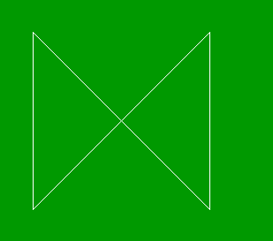

# PHP|imagecreate()函数

> Original: [https://www.geeksforgeeks.org/php-imagecreate-function/](https://www.geeksforgeeks.org/php-imagecreate-function/)

函数的作用是：**imagecreate()**是 PHP 中的内置函数，用于创建新图像。 此函数返回给定大小的空白图像。 通常使用**imagecreatetruecolor()**函数代替**imagecreate(**)函数，因为**imagecreatetruecolor()**函数可以创建高质量的图像。

**语法：**

```
imagecreate( $width, $height )
```

**参数：**此函数接受上述两个参数，如下所述：

*   **$width：**必选参数，用于指定图片宽度。
*   **$Height：**必选参数，用于指定图像高度。

**返回值：**此函数成功时返回图像资源标识符，出错时返回 False。

下面的程序演示了 PHP 中的**imagecreate()**函数：

**程序 1：**

```
<?php

// Create the size of image or blank image
$image = imagecreate(500, 300);

// Set the background color of image
$background_color = imagecolorallocate($image, 0, 153, 0);

// Set the text color of image
$text_color = imagecolorallocate($image, 255, 255, 255);

// Function to create image which contains string.
imagestring($image, 5, 180, 100,  "GeeksforGeeks", $text_color);
imagestring($image, 3, 160, 120,  "A computer science portal", $text_color);

header("Content-Type: image/png");

imagepng($image);
imagedestroy($image);

?>
```

**输出：**


**程序 2：**

```
<?php

// Create the size of image or blank image
$image = imagecreate(500, 300);

// Set the vertices of polygon
$values = array(
            50,  50,  // Point 1 (x, y)
            50, 250,  // Point 2 (x, y)
            250, 50,  // Point 3 (x, y)
            250,  250 // Point 3 (x, y)
        );
// Set the background color of image
$background_color = imagecolorallocate($image,  0, 153, 0);

// Fill background with above selected color
imagefill($image, 0, 0, $background_color);

// Allocate a color for the polygon
$image_color = imagecolorallocate($image, 255, 255, 255);

// Draw the polygon
imagepolygon($image, $values, 4, $image_color);

// Output the picture to the browser
header('Content-type: image/png');

imagepng($image);
?>
```

**输出：**


**相关文章：**

*   [PHP|imagepolygon()函数](https://www.geeksforgeeks.org/php-imagepolygon-function/)
*   [PHP|imagecolorat()函数](https://www.geeksforgeeks.org/php-imagecolorat-function/)

**引用：**[http://php.net/manual/en/function.imagecreate.php](http://php.net/manual/en/function.imagecreate.php)