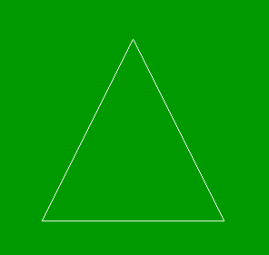

# PHP|imagecreatetruecolor()函数

> Original: [https://www.geeksforgeeks.org/php-imagecreatetruecolor-function/](https://www.geeksforgeeks.org/php-imagecreatetruecolor-function/)

**imagecreatetruecolor()**函数是 PHP 中的内置函数，用于创建新的真彩色图像。 此函数返回给定大小的空白图像。

**语法：**

```
*resource* imagecreatetruecolor( $width, $height )
```

**参数：**此函数接受上述两个参数，如下所述：

*   **$width：**该参数用于设置图片的宽度。
*   **$Height：**该参数用于设置图像的高度。

**返回值：**此函数成功时返回图像资源标识符，错误时返回 False。

以下程序说明了 PHP 中的**imagecreatetruecolor()**函数：

**程序 1：**

```
<?php

// Set the vertices of polygon
$values = array(
            150,  50, // Point 1 (x, y)
            50, 250,  // Point 2 (x, y)
            250,  250 // Point 3 (x, y)
        );

// Create the size of image or blank image
$image = imagecreatetruecolor(300, 300);

// Set the background color of image
$background_color = imagecolorallocate($image,  0, 153, 0);

// Fill background with above selected color
imagefill($image, 0, 0, $background_color);

// Allocate a color for the polygon
$image_color = imagecolorallocate($image, 255, 255, 255);

// Draw the polygon
imagepolygon($image, $values, 3, $image_color);

// Output the picture to the browser
header('Content-type: image/png');

imagepng($image);
?>
```

**输出：**


**程序 2：**

```
<?php

// Create the size of image or blank image.
$image = imagecreatetruecolor(500, 300);

// Display the height of image.
echo imagesy($image);

?>
```

**输出：**

```
300
```

**相关文章：**

*   [PHP|imagecolor 透明()函数](https://www.geeksforgeeks.org/php-imagecolortransparent-function/)
*   [PHP|imagepolygon()函数](https://www.geeksforgeeks.org/php-imagepolygon-function/)

**引用：**[http://php.net/manual/en/function.imagecreatetruecolor.php](http://php.net/manual/en/function.imagecreatetruecolor.php)