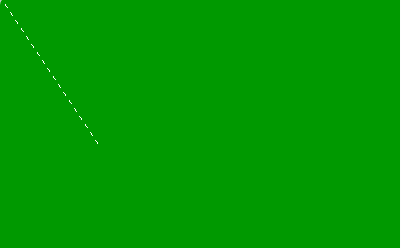

# PHP|imagedashedline()函数

> Original: [https://www.geeksforgeeks.org/php-imagedashedline-function/](https://www.geeksforgeeks.org/php-imagedashedline-function/)

**imagedashedline()**函数是 PHP 中的内置函数，用于绘制虚线。 此函数成功时返回 TRUE，否则返回 FALSE。

**语法：**

```php
*bool* imagedashedline( $image , $x1 , $y1 , $x2 , $y2 , $color )
```

**参数：**此函数接受上述 6 个参数，如下所述：

*   **$image：****imagecreatetruecolor()**函数用于创建给定大小的空白图像。
*   **$x1：**此参数用于保存左上角 x 坐标。
*   **$y1：**此参数用于保存左上角 y 坐标。 (0，0)是图像的左上角。
*   **$x2：**此参数用于保持右下角 x 坐标。
*   **$y2：**此参数用于保持右下角的 y 坐标。
*   **$COLOR：**此变量包含填充的颜色标识符。 使用**imagecolorallocation()**函数创建的颜色标识符。

**返回值：**此函数成功时返回 TRUE，失败时返回 FALSE。

下面的程序演示了 PHP 中的**imagedashedline()**函数。

**程序 1：**

```php
<?php

// Create the size of image or blank image
$image = imagecreatetruecolor(400, 300);

// Set the background color of image
$background_color = imagecolorallocate($image,  0, 153, 0);

// Fill background with above selected color
imagefill($image, 0, 0, $background_color);

// Set the color of dotted line in image
$color = imagecolorallocate($image,  255, 255, 255);

// Draw a dashed line
imagedashedline($image, 0, 0, 100, 150, $color);

// Output the image
header("Content-type: image/png");
imagepng($image);

?>
```

**输出：**


**程序 2：**

```php
<?php

// Create the size of image or blank image
$image = imagecreatetruecolor(400, 300);

// Set the background color of image
$background_color = imagecolorallocate($image,  0, 153, 0);

// Fill background with above selected color
imagefill($image, 0, 0, $background_color);

// Set the color of dotted line in image
$white = imagecolorallocate($image, 255, 255, 255);

// $value is an array variable stored color
// code of dotted image
$values = Array(
                $white, 
                $white, 
                $white, 
                $white, 
                IMG_COLOR_TRANSPARENT, 
                IMG_COLOR_TRANSPARENT, 
                IMG_COLOR_TRANSPARENT, 
                IMG_COLOR_TRANSPARENT
                );

imagesetstyle($image, $values);

// Draw the dashed line
imageline($image, 50, 150, 300, 150, IMG_COLOR_STYLED);

// Save the image
header("Content-type: image/png");
imagepng($image);

?>
```

**输出：**


**相关文章：**

*   [PHP|imagefilledpolygon()函数](https://www.geeksforgeeks.org/php-imagefilledpolygon-function/)
*   [PHP|ImageEllse()函数](https://www.geeksforgeeks.org/php-imageellipse-function/)
*   [PHP|imagefilledellipse()函数](https://www.geeksforgeeks.org/php-imagefilledellipse-function/)

**引用：**[http://php.net/manual/en/function.imagedashedline.php](http://php.net/manual/en/function.imagedashedline.php)