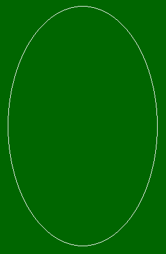

# PHP|ImageEllse()函数

> Original: [https://www.geeksforgeeks.org/php-imageellipse-function/](https://www.geeksforgeeks.org/php-imageellipse-function/)

函数的作用是：在 PHP 中内置函数，用于绘制椭圆。 此函数成功时返回 TRUE，失败时返回 FALSE。

**语法：**

```php
bool imageellipse( $image, $cx, $cy, $width, $height, $color )
```

**参数：**此函数接受上述 6 个参数，如下所述：

*   **$image：**它由图像创建函数之一返回，如 imagecreatetruecolor()。 它用于创建图像的大小。
*   **$cx：**x-中心坐标。
*   **$cy：**中心的 Y 坐标。
*   **$width：**椭圆宽度。
*   **$Height：**椭圆高度。
*   **$color：**它设置椭圆的颜色。 由 imagecolorallocation()函数创建的颜色标识符。

**返回值：**成功返回 TRUE，失败返回 FALSE。

下面的程序演示了 PHP 中的 imageellse()函数：

**程序 1：**

```php
<?php

// It create the size of image or blank image.
$image_size = imagecreatetruecolor(500, 300);

// Set the background color of image.
$background_color = imagecolorallocate($image_size, 255, 255, 255);

// Fill background with above selected color.
imagefill($image_size, 0, 0, $background_color);

// set color of ellipse.
$ellipse_color = imagecolorallocate($image_size, 0, 0, 0);

// Function to draw the ellipse.
imageellipse($image_size, 250, 150, 400, 250, $ellipse_color);

// Output the image.
header("Content-type: image/png");
imagepng($image_size);

?>
```

发帖主题：Re：Колибри0.7.0


**程序 2：**

```php
<?php

// It create the size of image or blank image.
$image = imagecreatetruecolor(300, 500);

// Set the background color of image.
$bg = imagecolorallocate($image, 0, 102, 0);

// Fill background with above selected color.
imagefill($image, 0, 0, $bg);

// set color of ellipse.
$col_ellipse = imagecolorallocate($image, 255, 255, 255);

// Function to draw the ellipse.
imageellipse($image, 150, 250, 250, 400, $col_ellipse);

// Output the image.
header("Content-type: image/png");
imagepng($image);

?>
```

发帖主题：Re：Колибри0.7.0



**引用：**[http://php.net/manual/en/function.imageellipse.php](http://php.net/manual/en/function.imageellipse.php)