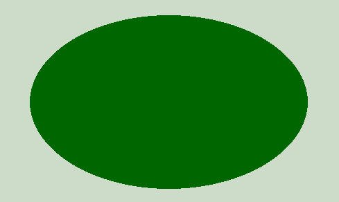
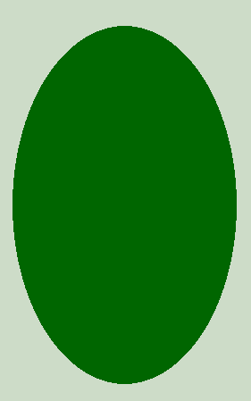

# PHP|imagefilledellipse()函数

> Original: [https://www.geeksforgeeks.org/php-imagefilledellipse-function/](https://www.geeksforgeeks.org/php-imagefilledellipse-function/)

**imagefilledellipse()**函数是 PHP 中的一个内置函数，用于绘制填充的椭圆。 它使用**指定的中心坐标**绘制椭圆。

**语法：**

```
*bool* imagefilledellipse( $image, $cx, $cy, $width, $height, $color )
```

**参数：**此函数接受上述 6 个参数，如下所述：

*   **$image：****imagecreatetruecolor()**函数用于创建给定大小的空白图像。
*   **$cx：**x-中心坐标。
*   **$cy：**中心的 Y 坐标。
*   **$width：**椭圆宽度。
*   **$Height：**椭圆高度。
*   **$color：**填充颜色。 使用 imagecolorallocation()创建的颜色标识符。

**返回值：**此函数成功时返回 TRUE，失败时返回 FALSE。

下面的程序演示了 PHP 中的**imagefilledellipse()**函数。

**程序 1：**

```
<?php

// It create the size of image or blank image.
$image = imagecreatetruecolor(500, 300);

// Set the background color of image.
$bg = imagecolorallocate($image, 205, 220, 200);

// Fill background with above selected color.
imagefill($image, 0, 0, $bg);

// Set the color of an ellipse.
$col_ellipse = imagecolorallocate($image, 0, 102, 0);

// Function to draw the filled ellipse.
imagefilledellipse($image, 250, 150, 400, 250, $col_ellipse);

// Output of the image.
header("Content-type: image/png");
imagepng($image);

?>
```

**输出：**


**程序 2：**

```
<?php

// It create the size of image or blank image.
$image = imagecreatetruecolor(300, 500);

// Set the background color of image.
$bg = imagecolorallocate($image, 205, 220, 200);

// Fill background with above selected color.
imagefill($image, 0, 0, $bg);

// set color of ellipse.
$col_ellipse = imagecolorallocate($image, 0, 102, 0);

// function to draw the filled ellipse with white color.
imagefilledellipse($image, 150, 250, 250, 400, $col_ellipse);

// output of the image.
header("Content-type: image/png");
imagepng($image);

?>
```

**输出：**


你也可以试着用同样的功能画个圈。

**相关文章：**[PHP|ImageEllse()函数](https://www.geeksforgeeks.org/php-imageellipse-function/)

**引用：**[http://php.net/manual/en/function.imagefilledellipse.php](http://php.net/manual/en/function.imagefilledellipse.php)