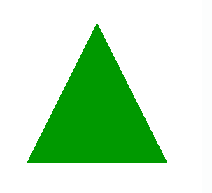
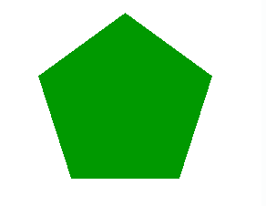

# PHP|imagefilledpolygon()函数

> Original: [https://www.geeksforgeeks.org/php-imagefilledpolygon-function/](https://www.geeksforgeeks.org/php-imagefilledpolygon-function/)

Imagefilledpolygon()函数是 PHP 中的一个内置函数，用于绘制填充多边形。 此函数成功时返回 TRUE，否则返回 FALSE。
**语法：**

```php
bool imagefilledpolygon( $image, $points, $num_points, $color )
```

**参数：**此函数接受上述四个参数，如下所述：

*   **$image：**imagecreatetruecolor()函数用于创建给定大小的空白图像。
*   **$Points：**此参数用于保存多边形的连续顶点。
*   **$NUM_POINTS：**此参数包含多边形中的顶点总数。 它必须大于 3，因为创建多边形至少需要三个顶点。
*   **$COLOR：**此变量包含填充的颜色标识符。 使用 imagecolorallocation()函数创建的颜色标识符。

**返回值：**此函数成功时返回 TRUE，失败时返回 FALSE。
下面的程序演示了 PHP 中的 imagefilledpolygon()函数。
**程序 1：**

## PHP

```php
<?php

// Set the vertices of polygon
$values = array(
            150,  50, // Point 1 (x, y)
            50, 250,  // Point 2 (x, y)
            250,  250 // Point 3 (x, y)
        );

// It create the size of image or blank image.
$image = imagecreatetruecolor(300, 300);

// Set image background color
$bg   = imagecolorallocate($image, 255, 255, 255);

// Set image color
$gr = imagecolorallocate($image, 0, 153, 0);

// fill the background
imagefilledrectangle($image, 0, 0, 300, 300, $bg);

// Draw the polygon
imagefilledpolygon($image, $values, 3, $gr);

// Output of the image.
header('Content-type: image/png');
imagepng($image);
?>
```

发帖主题：Re：Колибри0.7.8.0



**程序 2：**

## PHP

```php
<?php

// Set the vertices of polygon
$values = array(
            150, 50, // Point 1 (x, y)
            55, 119, // Point 2 (x, y)
            91, 231, // Point 3 (x, y)
            209, 231, // Point 4 (x, y)
            245, 119  // Point 5 (x, y)
            );

// It create the size of image or blank image.
$image = imagecreatetruecolor(300, 300);

// Set image background color
$bg   = imagecolorallocate($image, 255, 255, 255);

// Set image color
$blue = imagecolorallocate($image, 0, 153, 0);

// fill the background
imagefilledrectangle($image, 0, 0, 300, 300, $bg);

// Draw the polygon
imagefilledpolygon($image, $values, 5, $blue);

// Output of the image.
header('Content-type: image/png');
imagepng($image);
imagedestroy($image);
?>
```

发帖主题：Re：Колибри0.7.8.0



**相关文章：**

*   [PHP|imagefilledellipse()函数](https://www.geeksforgeeks.org/php-imagefilledellipse-function/)
*   [PHP|ImageEllse()函数](https://www.geeksforgeeks.org/php-imageellipse-function/)

**引用：**[http://php.net/manual/en/function.imagefilledpolygon.php](http://php.net/manual/en/function.imagefilledpolygon.php)