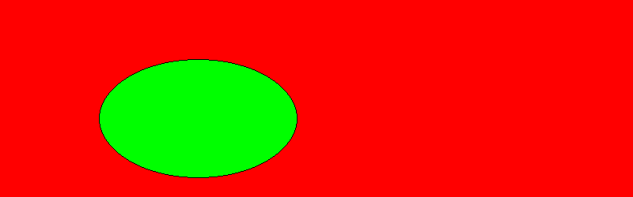

# PHP|imagefilltoedge()函数

> Original: [https://www.geeksforgeeks.org/php-imagefilltoborder-function/](https://www.geeksforgeeks.org/php-imagefilltoborder-function/)

函数**的作用是：**是 PHP 中的一个内置函数，用于使用特定颜色执行泛洪填充，并使用边框颜色添加边框。

**语法：**

```
*bool* imagefilltoborder( *resource* $image, *int* $x, *int* $y, *int* $border, *int* $color )
```

**参数：**此函数接受上述五个参数，如下所述：

*   **$image：**它指定要处理的图像。
*   **$x：**它指定起点的 x 坐标。
*   **$y：**它指定起点的 y 坐标。
*   **$BORDER：**它指定边框颜色。
*   **$color：**它指定填充颜色。

**返回值：**此函数成功时返回 TRUE，失败时返回 FALSE。

**异常：**此函数在出错时抛出异常。

下面给出的程序演示了 PHP 中的**imagefilltoedge()函数**：

**程序 1(向图像添加填充颜色)：**

```
<?php

// Load the png image
$im = imagecreatefrompng(
'https://media.geeksforgeeks.org/wp-content/uploads/geeksforgeeks-13.png');

// Create colors
$borderColor = imagecolorallocate($im, 0, 200, 0);
$fillColor = imagecolorallocate($im, 0, 0, 200);

// Add fill to border
imagefilltoborder($im, 0, 0, $borderColor, $fillColor);

// Show the output
header('Content-type: image/png');
imagepng($im);
?>
```

**输出：**


**程序 2(向图形添加填充颜色)：**

```
<?php

// Create the image handle, set the background to white
$im = imagecreatetruecolor(800, 250);
imagefilledrectangle($im, 0, 0, 800,
        250, imagecolorallocate($im, 0, 255, 0));

// Draw an ellipse to fill with a black border
imageellipse($im, 250, 150, 250, 150,
        imagecolorallocate($im, 0, 0, 0));

// Fill the selection
imagefilltoborder($im, 50, 50, imagecolorallocate($im,
        0, 0, 0), imagecolorallocate($im, 255, 0, 0));

// Output the image
header('Content-type: image/png');
imagepng($im);
?>
```

**输出：**


**引用：**[https://www.php.net/manual/en/function.imagefilltoborder.php](https://www.php.net/manual/en/function.imagefilltoborder.php)