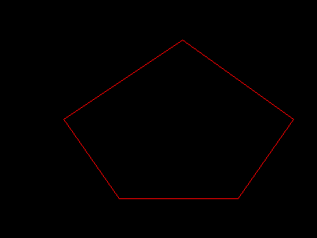

# PHP|imageopenpolygon()函数

> Original: [https://www.geeksforgeeks.org/php-imageopenpolygon-function/](https://www.geeksforgeeks.org/php-imageopenpolygon-function/)

**imageopenpolygon()函数**是 PHP 中的一个内置函数，用于绘制开放多边形。

**语法：**

```
*bool* imageopenpolygon( *resource* $image, *array* $points,
*int* $num_points, *int* $color )
```

**参数：**此函数接受上述四个参数，如下所述：

*   **$image：**它指定要处理的图像资源。
*   **$Points：**它指定多边形的点。
*   **$NUM_POINTS：**它指定点数。
*   **$color：**它指定多边形的颜色。

**返回值：**此函数成功时返回 TRUE，失败时返回 FALSE。

下面的示例说明了 PHP 中的**imageopenpolygon()函数**：

**示例 1：**在本例中，我们将在空白图形上绘制多边形。

```
<?php

// Create a blank image
$image = imagecreatetruecolor(400, 300);

// Prepare the colors
$red = imagecolorallocate($image, 255, 0, 0);

// Points of array
$points =  array(
    80, 150,
    150, 250,
    300, 250,
    370, 150,
    230, 50,
    80, 150
);

// Create an polygon
imageopenpolygon($image, $points, 6, $red);

// Output to browser
header('Content-type: image/png');
imagepng($image);
imagedestroy($image);
?>
```

**输出：**


**示例 2：**在此示例中，在图像上绘制多边形。

```
<?php

// Create an image instance
$image = imagecreatefrompng(
'https://media.geeksforgeeks.org/wp-content/uploads/geeksforgeeks-13.png');

// Prepare the colors
$red = imagecolorallocate($image, 255, 0, 0);

// Points of array
$points =  array(
    10, 10,
    660, 10,
    660, 100,
    10, 100,
    10, 10
);

// Create an polygon
imageopenpolygon($image, $points, 5, $red);

// Output to browser
header('Content-type: image/png');
imagepng($image);
imagedestroy($image);
?>
```

**输出：**


**引用：**[https://www.php.net/manual/en/function.imageopenpolygon.php](https://www.php.net/manual/en/function.imageopenpolygon.php)