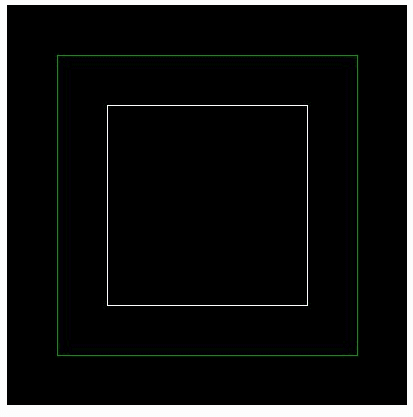
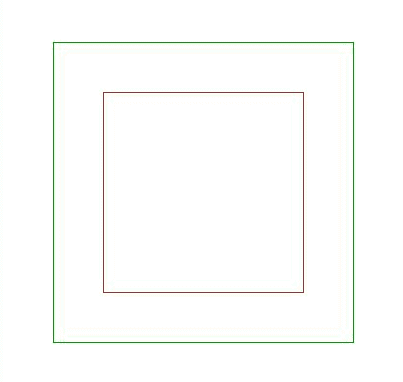

# PHP|imagerectangle()函数

> Original: [https://www.geeksforgeeks.org/php-imagerectangle-function/](https://www.geeksforgeeks.org/php-imagerectangle-function/)

**imagerectangle()**函数是 PHP 中的一个内置函数，用于绘制矩形。

**语法：**

```
*bool* imagerectangle( $image, $x1, $y1, $x2, $y2, $color )
```

**参数：**此函数接受上述 6 个参数，如下所述：

*   **$image：**它由图像创建函数之一返回，如 imagecreatetruecolor()。 它用于创建图像的大小。
*   **$x1：**此参数用于设置左上角 x 坐标。
*   **$y1：**此参数用于设置左上角 y 坐标。
*   **$x2：**此参数用于设置右下角 x 坐标。
*   **$y2：**此参数用于设置右下角 y 坐标。
*   **$color：**使用 imagecolorallocation()创建的颜色标识符。

**返回值：**此函数成功时返回 True，失败时返回 False。

下面的程序演示了 PHP 中的**imagerectangle()**函数：

**程序 1：**

```
<?php

// Create an image  of given size
$image = imagecreatetruecolor(400, 400);

// Create an image color
$green = imagecolorallocate($image, 0, 153, 0);
$white = imagecolorallocate($image, 255, 255, 255);

// Draw the rectangle
imagerectangle($image, 50, 50, 350, 350, $green);
imagerectangle($image, 100, 100, 300, 300, $white);

// Output and free from memory
header('Content-Type: image/jpeg');

imagejpeg($image);
imagedestroy($image);
?>
```

**输出：**


**程序 2：**

```
<?php

// Create an image  of given size
$image = imagecreatetruecolor(400, 400);

// Set the background color of image 
$background_color = imagecolorallocate($image,  255, 255, 255); 

// Fill background with above selected color 
imagefill($image, 0, 0, $background_color); 

// Create an image color
$green = imagecolorallocate($image, 0, 153, 0);
$white = imagecolorallocate($image, 155, 53, 32);

// Draw the rectangle
imagerectangle($image, 50, 50, 350, 350, $green);
imagerectangle($image, 100, 100, 300, 300, $white);

// Output and free from memory
header('Content-Type: image/jpeg');

imagejpeg($image);
imagedestroy($image);
?>
```

**输出：**


**引用：**[http://php.net/manual/en/function.imagerectangle.php](http://php.net/manual/en/function.imagerectangle.php)