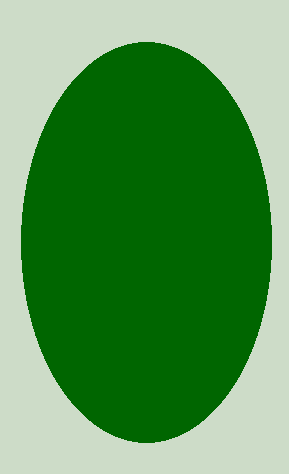

# PHP|imagerotate()函数

> Original: [https://www.geeksforgeeks.org/php-imagerotate-function/](https://www.geeksforgeeks.org/php-imagerotate-function/)

**imagerotate()函数**是 PHP 中的一个内置函数，用于将图像旋转到给定角度(以度为单位)。 图像的旋转中心是中心。

**语法：**

```php
*resource* imagerotate( $image, $angle, $bgd_color, $ignore_transparent = 0 ) 
```

**参数：**此函数接受上述四个参数，如下所述：

*   **$image：**它由图像创建函数之一返回，如 imagecreatetruecolor()。 它用于创建图像的大小。
*   **$angle：**此参数以度为单位保存旋转角度。 旋转角度用于逆时针旋转图像。
*   **$bgd_color：**此参数保持旋转后未覆盖区域的背景色。
*   **$IGNORE_THERNAL：**如果此参数设置为非零值，则忽略透明颜色。

**返回值：**此函数成功时返回旋转图像的图像资源，失败时返回 False。

下面的程序演示了 PHP 中的 imagerotate()函数：

**程序 1：**

```php
<?php 

// Assign image file to variable 
$image_name = 
'https://media.geeksforgeeks.org/wp-content/uploads/geeksforgeeks-15.png'; 

// Load image file 
$image = imagecreatefrompng($image_name);  

// Use imagerotate() function to rotate the image
$img = imagerotate($image, 180, 0);

// Output image in the browser 
header("Content-type: image/png"); 

imagepng($img); 

?> 
```

**输出：**


**程序 2：**

```php
<?php 

// It create the size of image or blank image. 
$image = imagecreatetruecolor(500, 300); 

// Set the background color of image. 
$bg = imagecolorallocate($image, 205, 220, 200); 

// Fill background with above selected color. 
imagefill($image, 0, 0, $bg); 

// Set the color of an ellipse. 
$col_ellipse = imagecolorallocate($image, 0, 102, 0); 

// Function to draw the filled ellipse. 
imagefilledellipse($image, 250, 150, 400, 250, $col_ellipse); 

// Use imagerotate() function to rotate the image
$img = imagerotate($image, 90, 0);

// Output image in the browser 
header("Content-type: image/png"); 

imagepng($img); 

?> 
```

**输出：**


**引用：**[https://www.php.net/manual/en/function.imagerotate.php](https://www.php.net/manual/en/function.imagerotate.php)