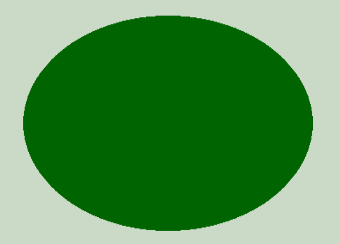

# PHP|imagescale()函数

> Original: [https://www.geeksforgeeks.org/php-imagescale-function/](https://www.geeksforgeeks.org/php-imagescale-function/)

函数**imagescale()**是 PHP 中的一个内置函数，用于使用给定的新宽度和高度缩放图像。

**语法：**

```php
*resource* imagescale( $image, $new_width, $new_height = -1, $mode = IMG_BILINEAR_FIXED )
```

**参数：**此函数接受上述四个参数，如下所述：

*   **$image：**它由图像创建函数之一返回，如 imagecreatetruecolor()。 它用于创建图像的大小。
*   **$new_width：**此参数保存缩放图像的宽度。
*   **$NEW_HEIGHT：**此参数保存缩放图像的高度。 如果此参数的值为负值或省略，则图像的纵横比将保持不变。
*   **$mode：**此参数保存模式。 此参数的值是*IMG_NEAREST_NEXOUR、IMG_BILINEAR_FIXED、IMG_BICUBIC、IMG_BICUBIC_FIXED*或任何其他值之一。

**返回值：**该函数成功时返回缩放图片的资源，失败时返回 False。

下面的程序演示了 PHP 中的 imagescale()函数：

**程序 1：**

```php
<?php 

// Assign image file to variable 
$image_name = 
'https://media.geeksforgeeks.org/wp-content/uploads/geeksforgeeks-15.png'; 

// Load image file 
$image = imagecreatefrompng($image_name);  

// Use imagescale() function to scale the image
$img = imagescale( $image, 500, 400 );

// Output image in the browser 
header("Content-type: image/png"); 
imagepng($img); 

?> 
```

**输出：**


**程序 2：**

```php
<?php 

// It create the size of image or blank image. 
$image = imagecreatetruecolor(500, 300); 

// Set the background color of image. 
$bg = imagecolorallocate($image, 205, 220, 200); 

// Fill background with above selected color. 
imagefill($image, 0, 0, $bg); 

// Set the color of an ellipse. 
$col_ellipse = imagecolorallocate($image, 0, 102, 0); 

// Function to draw the filled ellipse. 
imagefilledellipse($image, 250, 150, 400, 250, $col_ellipse); 

// Use imagescale() function to scale the image
$img = imagescale ( $image, 700, 500 );

// Output image in the browser 
header("Content-type: image/png"); 
imagepng($img); 

?> 
```

**输出：**


**引用：**[https://www.php.net/manual/en/function.imagescale.php](https://www.php.net/manual/en/function.imagescale.php)