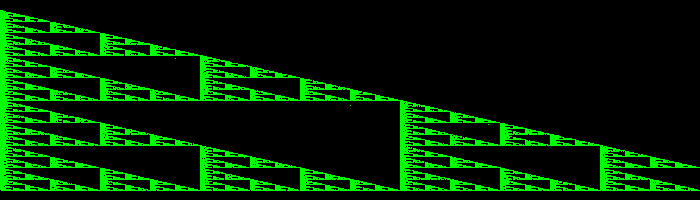

# PHP|imagesetPixel()函数

> Original: [https://www.geeksforgeeks.org/php-imagesetpixel-function/](https://www.geeksforgeeks.org/php-imagesetpixel-function/)

函数**的作用是：**是 PHP 中的一个内置函数，用于在指定的坐标处绘制像素。

**语法：**

```php
*bool* imagesetpixel( *resource* $image, *int* $x, *int* $y, *int* $color )

```

**参数：**此函数接受上述四个参数，如下所述：

*   **$image：**它指定要处理的图像资源。
*   **$x：**它指定像素的 x 坐标。
*   **$y：**它指定像素的 y 坐标。
*   **$color：**它指定像素的颜色。

**返回值：**此函数成功时返回 TRUE，失败时返回 FALSE。

下面给出的程序说明了 PHP 中的**imagesetPixel()函数**：

**程序 1(在图像上画线)：**

## PHP

```php
<?php

// Load the png image
$image = imagecreatefrompng(
'https://media.geeksforgeeks.org/wp-content/uploads/geeksforgeeks-13.png');

// Draw a line using imagesetpixel
$red = imagecolorallocate($image, 255, 0, 0);
for ($i = 0; $i < 1000; $i++) {
    imagesetpixel($image, $i, 100, $red);
}

// Output image to the browser
header('Content-type: image/png');
imagepng($image);
?>
```

发帖主题：Re：Колибри0.7.0


**程序 2(绘制图案)：**

## PHP

```php
<?php

  // Create a blank image 700x200
$image = imagecreatetruecolor(700, 200);

$points = [
    array('x' => 00, 'y' => 10),
    array('x' => 0, 'y' => 190),
    array('x' => 800, 'y' => 190)
];

// Prepare the color
$green = imagecolorallocate($image, 0, 255, 0);

// Draw the pattern
$x = 700;
$y = 200;
for ($i = 0; $i < 100000; $i++) {
    imagesetpixel($image, round($x), round($y), $green);
    $a = rand(0, 2);
    $x = ($x + $points[$a]['x']) / 2;
    $y = ($y + $points[$a]['y']) / 2;
}

// Show the output in browser
header('Content-Type: image/png');
imagepng($image);
?>
```

发帖主题：Re：Колибри0.7.0



**引用：**[https://www.php.net/manual/en/function.imagesetpixel.php](https://www.php.net/manual/en/function.imagesetpixel.php)