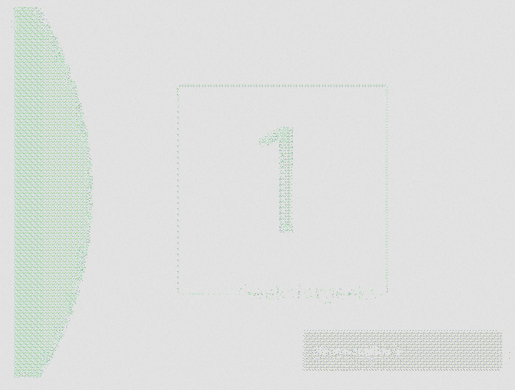

# PHP|Imagick autoLevelImage()函数

> Original: [https://www.geeksforgeeks.org/php-imagick-autolevelimage-function/](https://www.geeksforgeeks.org/php-imagick-autolevelimage-function/)

**Imagick：：autoLevelImage()**函数是 PHP 中的内置函数，用于调整特定图像通道的级别。 图像通道的电平被设置为全量子范围内的颜色的最小值和最大值。

**语法：**

```
*bool* Imagick::autoLevelImage( $channel )
```

**参数：**此函数接受用于设置自动调平的单个参数*$channel*。

**返回值：**成功时此函数返回 True。

下面的程序演示了 PHP 中的 I**magick：：autoLevelImage()**函数：

**程序 1：**

```
<?php

// Create an image object
$imagick = new Imagick(
'https://media.geeksforgeeks.org/wp-content/uploads/geeksforgeeks-9.png');

// Set the autolevelling of image
$imagick->autoLevelImage();

// Display the image
header("Content-Type: image/jpg");
echo $imagick->getImageBlob();
?>
```

**输出：**


**程序 2：**

```
<?php

// Create an image object
$imagick = new Imagick(
'https://media.geeksforgeeks.org/wp-content/uploads/slider.gif');

// Set the autolevelling of image
$imagick->autoLevelImage();

// Display the image
header("Content-Type: image/gif");
echo $imagick->getImageBlob();
?>
```

**输出：**


**相关文章：**

*   [PHP|Imagick borderImage()函数](https://www.geeksforgeeks.org/php-imagick-borderimage-function/)
*   [PHP|Imagick AdaptiveResizeImage()函数](https://www.geeksforgeeks.org/php-imagickadaptiveresizeimage-function/)
*   [PHP|Imagick addNoiseImage()函数](https://www.geeksforgeeks.org/php-imagickaddnoiseimage-function/)

**引用：**[http://php.net/manual/en/imagick.autolevelimage.php](http://php.net/manual/en/imagick.autolevelimage.php)