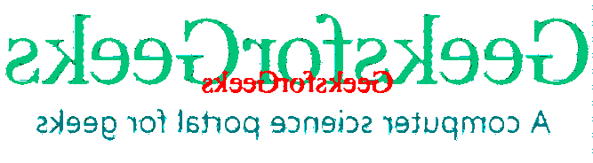

# PHP|Imagick verageImages()函数

> Original: [https://www.geeksforgeeks.org/php-imagick-averageimages-function/](https://www.geeksforgeeks.org/php-imagick-averageimages-function/)

**Imagick：：AverageImages()函数**是 PHP 中的一个内置函数，用于在图像处理后创建平均两个或多个图像。 它在 PECL Imagick 2.0.0 版本中有很好的定义。 此函数在 Imagick 的后续版本中已不再使用，因此在 PECL Imagick 2.1.0 版本中将其替换为 Imagick：：mergeImageLayers()。

**语法：**

```php
*Imagick* Imagick::averageImages( void )
```

**返回值：**如果成功，此函数将返回一个新的 Imagick 对象。

**错误/异常：**发生错误时抛出 ImagickException。

下面的程序演示了 PHP 中的 Imagick：：AverageImages()函数：

**程序：**

```php
<?php 

// Store the path of an image into variable
$imagePath =
"https://media.geeksforgeeks.org/wp-content/uploads/20190912230402/hexgon_compositeImage.png";

// Create a new Imagick object
$imagick = new \Imagick($imagePath);

// Create a new ImagickDraw object
$draw = new \ImagickDraw();

// Draw an image and set its font size
$draw->setFontSize(35);

// Set the color of text
$fillcolor = new \ImagickPixel("red");

// Set the fill color
$draw->setFillColor($fillcolor);

// Set the gravity
$draw->setGravity(Imagick::GRAVITY_CENTER);

// Annotate the text "GeeksforGeeks" to the image
$imagick->annotateImage( $draw, 0, 0, 0, "GeeksforGeeks");

// Assign thresholdcolor to the image 
$thresholdColor = "rgb(255, 0, 0)";

$imagick->blackthresholdimage($thresholdColor);

// Flop the image
$imagick->flopImage();

// Turn image to oil paint image
$imagick->oilPaintImage(1);
$imagick->resetIterator();

// Merging all image layers and flattened
$imagick->mergeImageLayers(Imagick::LAYERMETHOD_FLATTEN);

// It works in PECL imagick 2.0.0 version,
// comment it when higher version.
$imagick->averageImages(); 

header("Content-Type: image/png");
header("Cache-Control: no-store, no-cache");  

// Downloading output image of 
// Imagick::averageImage() function
header('Content-Disposition: attachment; filename="average.png"');

echo $imagick->getImageBlob();

?>
```

**输出：**


**引用：**[https://www.php.net/manual/en/imagick.averageimages.php](https://www.php.net/manual/en/imagick.averageimages.php)