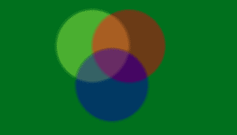

# PHP|Imagick blurImage()函数

> Original: [https://www.geeksforgeeks.org/php-imagick-blurimage-function/](https://www.geeksforgeeks.org/php-imagick-blurimage-function/)

**Imagick：：blurImage()**函数是 PHP 中的内置函数，用于向图像添加模糊滤镜。 此函数在成功时返回 True。

**语法：**

```php
*bool* Imagick::blurImage( $radius, $sigma, $channel )
```

**参数：**此函数接受上述三个参数，如下所述：

*   **$Radius：**此参数用于设置图像中的模糊半径。
*   **$sigma：**它设置标准偏差。
*   **$channel：**此参数设置通道类型常量。 如果没有提供，则所有通道都是模糊的。

**返回值：**成功时此参数返回 True。

下面的程序演示了 PHP 中的**Imagick：：blurImage()**函数：

**程序 1：**

```php
<?php

// Create an Imagick object
$image = new Imagick(
'https://media.geeksforgeeks.org/wp-content/uploads/geeksforgeeks-9.png');

header('Content-type: image/jpeg');

// Use blurImage function
$image->blurImage(5, 3);

// Display the output image
echo $image;
?>
```

**输出：**


**程序 2：**

```php
<?php

// Create an Imagick object
$image = new Imagick(
'https://media.geeksforgeeks.org/wp-content/uploads/col1.png');

header('Content-type: image/jpeg');

// Use blurImage function
$image->blurImage(7, 3);

// Display the output image
echo $image;
?>
```

**输出：**


**相关文章：**

*   [PHP|Imagick choImage()函数](https://www.geeksforgeeks.org/php-imagick-chopimage-function/)
*   [PHP|Imagick AdaptiveBlurImage()函数](https://www.geeksforgeeks.org/php-imagickadaptiveblurimage-function/)

**引用：**[http://php.net/manual/en/imagick.blurimage.php](http://php.net/manual/en/imagick.blurimage.php)