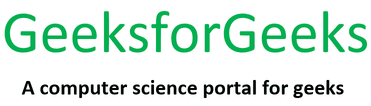

# PHP|Imagick gaussianBlurImage()函数

> Original: [https://www.geeksforgeeks.org/php-imagick-gaussianblurimage-function/](https://www.geeksforgeeks.org/php-imagick-gaussianblurimage-function/)

**Imagick：：gaussianBlurImage()**函数是 PHP 中用于模糊图像的内置函数。 此函数将图像与给定半径和标准差(Sigma)的高斯运算符进行卷积。

**注：**为获得合理的结果，半径应大于 sigma。

**语法：**

```
*bool* Imagick::gaussianBlurImage( $radius, $sigma, $channel = Imagick::CHANNEL_DEFAULT )
```

**参数：**此函数接受上述三个参数，如下所述：

*   **$Radius(浮点型)：**此参数以像素为单位提供高斯区域的半径，不包括中心像素。
*   **$sigma(浮点型)：**此参数以像素为单位给出高斯区域的标准偏差。
*   **$channel(Int Type)：**此参数根据我们的要求提供通道(有效)。 要应用多个通道，请使用按位运算符组合通道类型常量。

**返回值：**成功时此函数返回 True。

**错误：**此函数在出错时引发 ImagickException。

**原始图像：**


现在，我们将编写一个 PHP 程序来演示 PHP 中的 Imagick：：gaussianBlurImage()函数来模糊上面的图像。

**程序：**此程序使用 Imagick：：gaussianBlurImage()函数模糊图像。

```
<?php

// Create an Imagick object
$imagick = new Imagick(
'https://media.geeksforgeeks.org/wp-content/uploads/20190706091214/originalgfg.png');

// Use gaussianBlurImage() function to blur the image
$imagick->gaussianBlurImage(10, 8, Imagick::CHANNEL_DEFAULT);

// Image header
header("Content-Type: image/jpg");

// Display the output image
echo $imagick->getImageBlob();

?>
```

**输出：**
