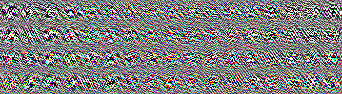
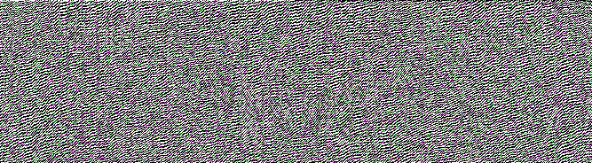

# PHP|Imagick inverseFurierTransformImage()函数

> Original: [https://www.geeksforgeeks.org/php-imagick-inversefouriertransformimage-function/](https://www.geeksforgeeks.org/php-imagick-inversefouriertransformimage-function/)

**Imagick：：InverseFurierTransformImage()函数**是 PHP 中的一个内置函数，用于实现图像的离散傅立叶逆变换(DFT)，可以是幅值/相位图像对，也可以是实像/虚像图像对。

**语法：**

```
*bool* Imagick::inverseFourierTransformImage( *imagickObject* $imagick, *float* $complement )
```

**参数：**此函数接受上述两个参数，如下所述：

*   **$imagick：**它指定要与此图像组合的第二个图像，以形成幅度/相位或实数/虚数图像对。
*   **$补码：**它包含一个布尔值，如果为真，则组合为幅度/相位对，否则为实/虚图像对。

**返回值：**如果成功，此函数返回 TRUE。

**异常：**此函数在出错时引发 ImagickException。

下面给出的程序演示了 PHP 中的**Imagick：：InverseFurierTransformImage()函数**：

**程序 1：**

```
<?php

// Create a new Imagick object
$imagick1 = new Imagick(
'https://media.geeksforgeeks.org/wp-content/uploads/geeksforgeeks-13.png');

$imagick2 = new Imagick(
'https://media.geeksforgeeks.org/wp-content/uploads/20190918234528/colorize1.png');

$imagick1->inverseFourierTransformImage($imagick2, true);

// Display the image
header("Content-Type: image/png");
echo $imagick1->getImageBlob();
?>
```

**输出：**


**程序 2：**

```
<?php

// Create a new Imagick object
$imagick1 = new Imagick(
'https://media.geeksforgeeks.org/wp-content/uploads/geeksforgeeks-13.png');

$imagick2 = new Imagick(
'https://media.geeksforgeeks.org/wp-content/uploads/geeksforgeeks-13.png');

$imagick1->inverseFourierTransformImage($imagick2, false);

// Display the image
header("Content-Type: image/png");
echo $imagick1->getImageBlob();
?>
```

**输出：**


**引用：**[https://www.php.net/manual/en/imagick.inversefouriertransformimage.php](https://www.php.net/manual/en/imagick.inversefouriertransformimage.php)