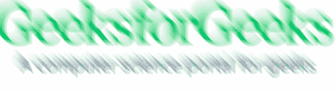

# PHP|Imagick motionBlurImage()函数

> Original: [https://www.geeksforgeeks.org/php-imagick-motionblurimage-function/](https://www.geeksforgeeks.org/php-imagick-motionblurimage-function/)

**Imagick：：motionBlurImage()**函数是 PHP 中的内置函数，用于模拟运动模糊。 此函数将图像与给定半径和标准差的高斯运算符进行卷积。

**语法：**

```php
*bool* Imagick::motionBlurImage( $radius, $sigma, $angle, $channel )
```

**参数：**此函数接受上述四个参数，如下所述：

*   **$Radius：**此参数用于设置高斯半径(以像素为单位)。 它不包括中心像素。 如果半径值为零，则表示将自动选择半径。
*   **$sigma：**此参数用于查找高斯的标准偏差(以像素为单位)。
*   **$angle：**此参数沿此角度应用效果。
*   **$channel：**此参数提供对通道模式有效的通道常量。 可以使用按位运算符组合多个通道。 Imagick 函数中的默认通道是 Imagick：：Channel_Default。

**返回值：**成功时此函数返回 True。

下面的程序演示了 PHP 中的**Imagick：：motionBlurImage()**函数：

**程序：**

```php
<?php

// Create an Imagick object
$imagick = new Imagick(
'https://media.geeksforgeeks.org/wp-content/uploads/geeksforgeeks-9.png');

// Use motionBlurImage function
$imagick->motionBlurImage(20, 20, 45);

header("Content-Type: image/jpg");

// Display the output image
echo $imagick->getImageBlob();
?>
```

**输出：**


**引用：**[http://php.net/manual/en/imagick.motionblurimage.php](http://php.net/manual/en/imagick.motionblurimage.php)