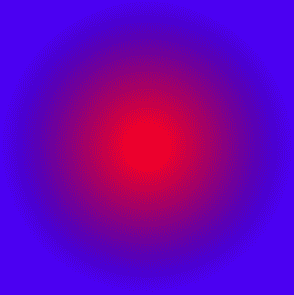

# PHP|Imagick newPseudoImage()函数

> Original: [https://www.geeksforgeeks.org/php-imagick-newpseudoimage-function/](https://www.geeksforgeeks.org/php-imagick-newpseudoimage-function/)

**Imagick：：newPseudoImage()**函数是 PHP 中的一个内置函数，用于使用 ImageMagick 伪格式创建新图像。

**语法：**

```
*bool* Imagick::newPseudoImage( $columns, $rows, $pseudoString )
```

**参数：**此函数接受上述三个参数，如下所述：

*   **$Columns：**此参数用于设置新图像中的列。
*   **$ROWS：**此参数用于设置新图像中的行。
*   **$PseudoString：**此参数用于保存包含伪图像定义的字符串。

**返回值：**成功时此函数返回 True。

**错误/异常：**此函数在出错时引发 ImagickException。

下面的程序演示了 PHP 中的**Imagick：：newPseudoImage()**函数：

**程序：**

```
<?php

// Create an Imagick object
$imagick = new \Imagick();

// Use newPseudoImage function
$imagick->newPseudoImage(300, 300, 
            'radial-gradient:red-blue');

// Set the image format
$imagick->setImageFormat("png");

header("Content-Type: image/png");

// Display the output image
echo $imagick->getImageBlob();
?>
```

**输出：**


**引用：**[http://php.net/manual/en/imagick.newpseudoimage.php](http://php.net/manual/en/imagick.newpseudoimage.php)