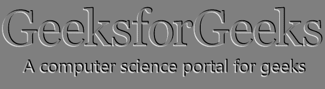

# PHP|Imagick shadeImage()函数

> Original: [https://www.geeksforgeeks.org/php-imagick-shadeimage-function/](https://www.geeksforgeeks.org/php-imagick-shadeimage-function/)

**Imagick：：shadeImage()**函数是 PHP 中的内置函数，用于创建给定图像的 3D 效果。 将平行光照射到图像上以创建三维效果。 方位角以 x 轴度为单位测量，仰角以 z 轴上方的像素为单位测量。

**语法：**

```php
*bool* Imagick::shadeImage( $gray, $azimuth, $elevation )
```

**参数：**此函数接受上述三个参数，如下所述：

*   **$GREAY：**此参数存储非零的值，并对每个像素的强度进行着色。
*   **$azimuth：**此参数存储光源方向的值。 它是以 x 轴的度数来测量的。
*   **$Elevation：**此参数存储光源方向的值。 它是以 z 轴上方的像素为单位测量的。

**返回值：**成功时此函数返回 True。

**原始图像：**


下面的程序演示了 PHP 中的**Imagick：：shadeImage()**函数：

**程序：**

```php
<?php 
// require_once('path/vendor/autoload.php'); 

// Create an Imagick Object

$imagick = new Imagick(
'https://media.geeksforgeeks.org/wp-content/uploads/geeksforgeeks-12.png');

// shadeImage Function
$imagick->shadeImage(true, 45, 20);

// Image Header
header("Content-Type: image/jpg");

// Display the image
echo $imagick->getImageBlob();
?>
```

**输出：**


**相关文章：**

*   [PHP|Imagick transsposeImage()函数](https://www.geeksforgeeks.org/php-imagick-transposeimage-function/)
*   [PHP|Imagick addNoiseImage()函数](https://www.geeksforgeeks.org/php-imagickaddnoiseimage-function/)

**引用：**[http://php.net/manual/en/imagick.shadeimage.php](http://php.net/manual/en/imagick.shadeimage.php)