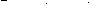

# PHP|Imagick SteganoImage()函数

> Original: [https://www.geeksforgeeks.org/php-imagick-steganoimage-function/](https://www.geeksforgeeks.org/php-imagick-steganoimage-function/)

**ImagickDraw：：steganoImage()函数**是 PHP 中的一个内置函数，用于在图像中隐藏数字水印。 水印也可以是简单的文本或图像。 通常，彩色图像会因此而失真。 隐藏的水印可以稍后恢复以证明图像的真实性。 偏移定义图像中隐藏水印的开始位置。 在恢复图像时需要偏移量。

**语法：**

```
*Imagick* ImagickDraw::steganoImage( *Imagick* $watermark_wand, *int* $offset )
```

**参数：**此函数接受上述两个参数，如下所述：

*   **$water mark_wand：**它指定秘密水印棒。
*   **$Offset：**它指定用于恢复水印带的秘密偏移量。

**返回值：**此函数返回包含水印图像的 Imagick 对象。

**异常：**此函数在出错时引发 ImagickException。

下面的程序说明了 PHP 中的**ImagickDraw：：steganoImage()函数**：

**程序 1：**

```
<?php

// Create a new imagick object
$imagick = new Imagick(
'https://media.geeksforgeeks.org/wp-content/uploads/geeksforgeeks-13.png');

// Create another Imagick object containing watermark
$watermark = new Imagick('label:This is my secret.');

// Hide $watermark inside $imagick
$imagick = $imagick->steganoImage($watermark, 64);

// Write image to the local folder
$imagick->writeImage('output.png');

// Set the offset
$imagick->setSizeOffset($watermark->getImageWidth(),
                   $watermark->getImageHeight(), 64);

// Read the encoded image and extract secret
$imagick->readImage('STEGANO:output.png');

// Show the output
$imagick->setImageFormat('png');
header("Content-Type: image/png");
echo $imagick->getImageBlob();
?>
```

**输出：**


**程序 2：**

```
<?php

// Create a new imagick object
$imagick = new Imagick(
'https://media.geeksforgeeks.org/wp-content/uploads/geeksforgeeks-13.png');

// Create another Imagick object containing a secret image
$watermark = new Imagick(
'https://media.geeksforgeeks.org/wp-content/uploads/20191203223000/segmentimage2.png');

// Hide $watermark inside $imagick
$imagick = $imagick->steganoImage($watermark, 10);

// Write image to the local folder
$imagick->writeImage('output.png');

// Set the offset
$imagick->setSizeOffset($watermark->getImageWidth(),
                   $watermark->getImageHeight(), 10);

// Read the encoded image and extract secret
$imagick->readImage('STEGANO:output.png');

// Show the output
$imagick->setImageFormat('png');
header("Content-Type: image/png");
echo $imagick->getImageBlob();
?>
```

**输出：**


**引用：**[https://www.php.net/manual/en/imagick.steganoimage.php](https://www.php.net/manual/en/imagick.steganoimage.php)