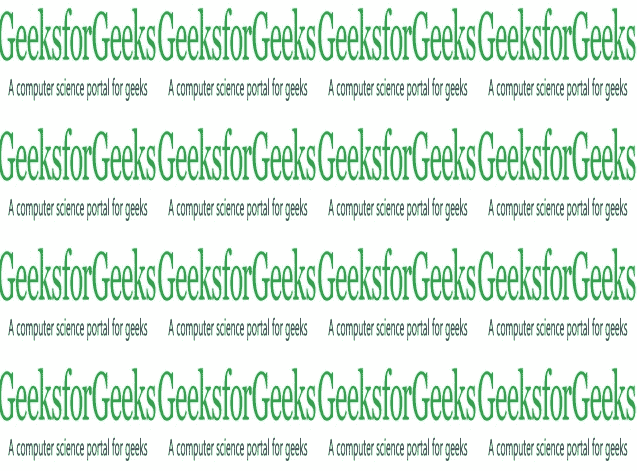

# PHP|Imagick textureImage()函数

> Original: [https://www.geeksforgeeks.org/php-imagick-textureimage-function/](https://www.geeksforgeeks.org/php-imagick-textureimage-function/)

**Imagick：：textureImage()**函数是 PHP 中的一个内置函数，它重复创建纹理图像的平铺。

**语法：**

```
*Imagick* Imagick::textureImage( $texture_wand )
```

**参数：**此函数接受单个参数*$Texture_wand*。 它是用作纹理图像的 Imagick 对象。

**返回值：**此函数返回应用了重复纹理的新 Imagick 对象。

**错误/异常：**此函数在出错时引发 ImagickException。

下面的程序演示了 PHP 中的**Imagick：：textureImage()**函数：

**程序：**

```
<?php

// Create an imagick object
$image = new Imagick();

// Create an image of given size
$image->newImage(640, 480, new ImagickPixel('green'));

// Set the image format
$image->setImageFormat("jpg");

// Take image input and create imagick object
$texture = new Imagick(
'https://media.geeksforgeeks.org/wp-content/uploads/geeksforgeeks-9.png');

// Scale the image
$texture->scaleimage($image->getimagewidth() / 4, $image->getimageheight() / 4);

// textureImage function
$image = $image->textureImage($texture);
header("Content-Type: image/jpg");

// Display the image
echo $image;
?>
```

**输出：**


**相关文章：**

*   [PHP|Imagick charcoalImage()函数](https://www.geeksforgeeks.org/php-imagick-charcoalimage-function/)
*   [PHP|Imagick choImage()函数](https://www.geeksforgeeks.org/php-imagick-chopimage-function/)

**引用：**[http://php.net/manual/en/imagick.textureimage.php](http://php.net/manual/en/imagick.textureimage.php)