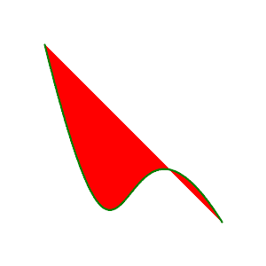

# PHP|ImagickDraw Bezier()函数

> Original: [https://www.geeksforgeeks.org/php-imagickdraw-bezier-function/](https://www.geeksforgeeks.org/php-imagickdraw-bezier-function/)

**ImagickDraw：：Bezier()**函数是 PHP 的 Imagick 库中内置的函数，用于绘制 Bezier 曲线。

**语法：**

```
*bool* ImagickDraw::bezier( $coordinates )
```

**参数：**此函数接受单个参数作为多维数组，该数组接受要绘制曲线的点。

**返回值：**此函数不返回任何值。

下面的程序演示了 PHP 中的**ImagickDraw：：Bezier()**函数：

**程序：**

```
<?php

// require_once('vendor/autoload.php');

$draw = new \ImagickDraw();

$strokeColor = new \ImagickPixel('Green');
$fillColor = new \ImagickPixel('Red');

$draw->setStrokeOpacity(1);
$draw->setStrokeColor('Green');
$draw->setFillColor('Red');

$draw->setStrokeWidth(2);

$pointsSet = [
        [
            ['x' => 10.0 * 5, 'y' => 10.0 * 5],
            ['x' => 30.0 * 5, 'y' => 90.0 * 5],
            ['x' => 25.0 * 5, 'y' => 10.0 * 5],
            ['x' => 50.0 * 5, 'y' => 50.0 * 5],
        ]
    ];

foreach ($pointsSet as $points) {
   $draw->bezier($points);
}

// Create an image object which draw commands 
// can be rendered into
$imagick = new \Imagick();
$imagick->newImage(300, 300, 'White');
$imagick->setImageFormat("png");

// Render the draw commands in the 
// ImagickDraw object into the image.
$imagick->drawImage($draw);

// Send the image to the browser
header("Content-Type: image/png");
echo $imagick->getImageBlob();
?>
```

**输出：**


**引用：**[http://php.net/manual/en/imagickdraw.bezier.php](http://php.net/manual/en/imagickdraw.bezier.php)