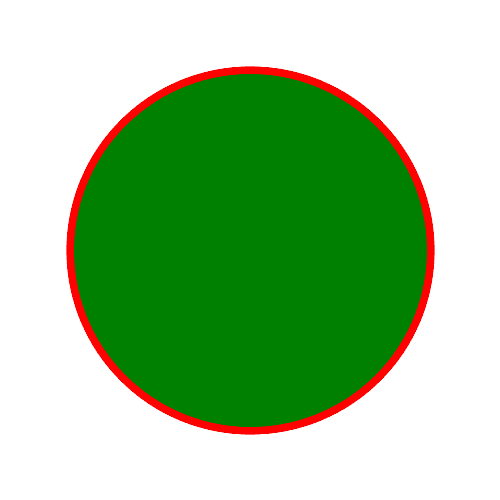

# PHP|ImagickDraw Circle()函数

> Original: [https://www.geeksforgeeks.org/php-imagickdraw-circle-function/](https://www.geeksforgeeks.org/php-imagickdraw-circle-function/)

**ImagickDraw：：Circle()**函数是 PHP 的 Imagick 库中的内置函数，用于画圆。

**语法：**

```php
*bool* ImagickDraw::circle( $ox, $oy, $px, $py )
```

**参数：**此函数接受上述四个参数，如下所述：

*   **$ox：**此参数采用原点 x 坐标的值。
*   **$oy：**此参数采用原点 y 坐标的值。
*   **$px：**此参数取周长 x 坐标的值。
*   **$py：**此参数采用周长 y 坐标的值。

**返回值：**此函数不返回任何值。

下面的程序演示了 PHP 中的**ImagickDraw：：Circle()**函数：

**程序：**

```php
<?php

// require_once('vendor/autoload.php');

// Create an ImagickDraw object
$draw = new \ImagickDraw();

// Create ImagickPixel object
$strokeColor = new \ImagickPixel('Red');
$fillColor = new \ImagickPixel('Green');

// Set the color, opacity of image
$draw->setStrokeOpacity(1);
$draw->setStrokeColor('Red');
$draw->setFillColor('Green');

// Set the width and height of image
$draw->setStrokeWidth(7);
$draw->setFontSize(72);

// Function to draw circle 
$draw->circle(250, 250, 100, 150);

$imagick = new \Imagick();
$imagick->newImage(500, 500, 'White');
$imagick->setImageFormat("png");
$imagick->drawImage($draw);

// Display the output image
header("Content-Type: image/png");
echo $imagick->getImageBlob();
?>
```

**输出：**


**引用：**[http://php.net/manual/en/imagickdraw.circle.php](http://php.net/manual/en/imagickdraw.circle.php)