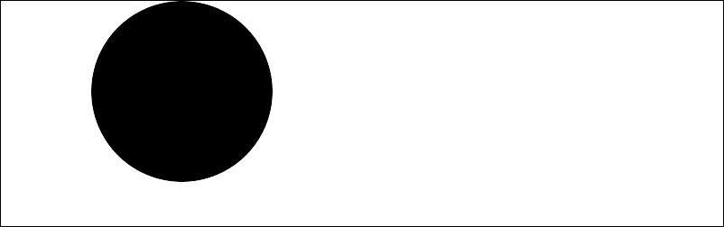

# PHP|ImagickDraw clone()函数

> Original: [https://www.geeksforgeeks.org/php-imagickdraw-clone-function/](https://www.geeksforgeeks.org/php-imagickdraw-clone-function/)

**ImagickDraw：：Clone()函数**是 PHP 中的一个内置函数，用于精确复制指定的 ImagickDraw 对象。

**语法：**

```php
*ImagickDraw* ImagickDraw::clone( *void* )
```

**参数：**此函数不接受任何参数。

**返回值：**成功时返回指定 ImagickDraw 对象的精确副本，失败时返回错误。

**异常：**此函数在出错时引发 ImagickException。

下面的程序演示了 PHP 中的**ImagickDraw：：Clone()函数**：

**程序 1：**

```php
<?php

// Create a new Imagick object
$imagick = new Imagick();

// Create a image on imagick object
$imagick->newImage(800, 250, 'white');

// Create a new ImagickDraw object
$draw = new ImagickDraw();

// Set the text properties
$draw->setFontSize(100);
$draw->setFillColor('blue');

// Apply the annotation() function
$draw->annotation(50, 150, 'GeeksforGeeks');

// Create a new ImagickDraw object
$copied = new ImagickDraw();

// Copy the object
$copied = $draw->clone();

//  Render the draw commands from copied object
$imagick->drawImage($copied);

// Show the output
$imagick->setImageFormat("png");
header("Content-Type: image/png");

echo $imagick->getImageBlob();
?>
```

**输出：**


**程序 2：**

```php
<?php

// Create a new Imagick object
$imagick = new Imagick();

// Create a image on imagick object
$imagick->newImage(800, 250, 'white');

// Create a new ImagickDraw object
$draw = new ImagickDraw();

// Draw a circle
$draw->circle(200, 100, 100, 100);

// Create a new ImagickDraw object
$copied = new ImagickDraw();

// Copy the object
$copied = $draw->clone();

//  Render the draw commands from copied object
$imagick->drawImage($copied);

// Add a border
$imagick->borderImage('black', 1, 1);

// Show the output
$imagick->setImageFormat("png");
header("Content-Type: image/png");

echo $imagick->getImageBlob();
?>
```

**输出：**


**引用：**[https://www.php.net/manual/en/imagickdraw.clone.php](https://www.php.net/manual/en/imagickdraw.clone.php)