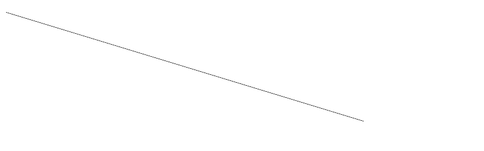

# PHP|ImagickDraw 销毁()函数

> Original: [https://www.geeksforgeeks.org/php-imagickdraw-destroy-function/](https://www.geeksforgeeks.org/php-imagickdraw-destroy-function/)

**ImagickDraw：：Destroy()函数**是 PHP 中的一个内置函数，用于释放与 ImagickDraw 对象关联的所有资源。

**语法：**

```
*bool* ImagickDraw::destroy( *void* )
```

**参数：**此函数不接受任何参数。

**返回值：**如果成功，此函数返回 TRUE。

**异常：**此函数在出错时引发 ImagickException。

下面的程序演示了 PHP 中的**ImagickDraw：：Destroy()函数**：

**程序 1：**

```
<?php

// Create a new ImagickDraw object
$draw = new ImagickDraw();

// Draw a circle
$draw->circle(10, 20, 600, 200);

// Draw a line
$draw->line(10, 20, 600, 200);

echo 'Before destroying:<br>';
echo $draw->getVectorGraphics();

// Destroy object
$draw->destroy();

echo '<br>After destroying:<br>';
echo $draw->getVectorGraphics();
?>
```

发帖主题：Re：Колибри0.7.0

> 销毁前：
> UndefinedNone#0000000000001Evenodd12UndefinedUndefined0Undefined#FFFFFFFFFFFFFFFF10ButtMiter1001Undefined1#000000000000FFFFcircle 10 20 600 200 行销毁后：
> UndefinedNone#0000000000001Evenodd12UndefinedUndefined0Undefined#FFFFFFFFFFFFFFFF10ButtMiter1001Undefined1#000000000000FFFF

**程序 2：**

```
<?php

// Create a new imagick object
$imagick = new Imagick();

// Create a image on imagick object
$imagick->newImage(800, 250, 'white');

// Create a new ImagickDraw object
$draw = new ImagickDraw();

// Draw a line
$draw->line(10, 20, 600, 200);

// Render the draw commands
$imagick->drawImage($draw);

// Destroy object after drawing
$draw->destroy();

// Show the output
$imagick->setImageFormat('png');
header("Content-Type: image/png");
echo $imagick->getImageBlob();
?>
```

**输出：**


**引用：**[https://www.php.net/manual/en/imagickdraw.destroy.php](https://www.php.net/manual/en/imagickdraw.destroy.php)