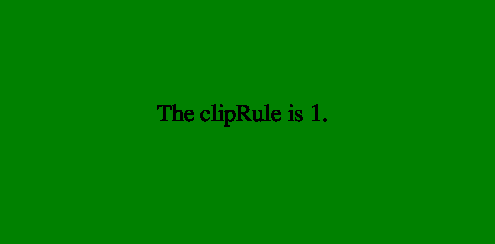

# PHP|ImagickDraw getClipRule()函数

> Original: [https://www.geeksforgeeks.org/php-imagickdraw-getcliprule-function/](https://www.geeksforgeeks.org/php-imagickdraw-getcliprule-function/)

**ImagickDraw：：getClipRule()函数**是 PHP 中的一个内置函数，用于获取剪切路径要使用的当前多边形填充规则。

**语法：**

```php
*int* ImagickDraw::getClipRule( *void* )
```

**参数：**此函数不接受任何参数。

**返回值：**此函数返回与[FILLRULE 常量](https://www.php.net/manual/en/imagick.constants.php/#imagick.constants.fillrule-undefined)之一对应的整数值。

下面给出了 FILLRULE 常量列表：

*   Imagick：：FILLRULE_UNDEFINED(0)
*   ==同步，由 Elderman 更正==@ELDER_MAN
*   ==同步，由 Elderman 更正==@ELDER_MAN

**异常：**此函数在出错时引发 ImagickException。

下面给出的程序演示了 PHP 中的**ImagickDraw：：getClipRule()函数**：

**程序 1：**

```php
<?php

// Create a new ImagickDraw object
$draw = new ImagickDraw();

// Get the clipRule
$clipRule = $draw->getClipRule();
echo $clipRule;
?>
```

发帖主题：Re：Колибри0.7.0

```php
1 // which is the default value.
```

**程序 2：**

```php
<?php

// Create a new imagick object
$imagick = new Imagick();

// Create a image on imagick object
$imagick->newImage(500, 250, 'green');

// Create a new ImagickDraw object
$draw = new ImagickDraw();

$draw->setClipRule(imagick::FILLRULE_EVENODD);

$draw->setFontSize(24);

$draw->annotation(160, 125, 
                  'The clipRule is '
                  . $draw->getClipRule() . '.');

// Render the draw commands
$imagick->drawImage($draw);

// Show the output
$imagick->setImageFormat('png');
header("Content-Type: image/png");
echo $imagick->getImageBlob();
?>
```

**输出：**


**引用：**[https://www.php.net/manual/en/imagickdraw.getcliprule.php](https://www.php.net/manual/en/imagickdraw.getcliprule.php)