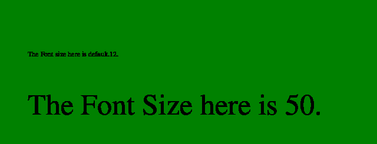

# PHP|ImagickDraw getFontSize()函数

> Original: [https://www.geeksforgeeks.org/php-imagickdraw-getfontsize-function/](https://www.geeksforgeeks.org/php-imagickdraw-getfontsize-function/)

**ImagickDraw：：getFontSize()函数**是 PHP 中的一个内置函数，用于获取在注释文本时使用的字体磅值。

**语法：**

```php
*float* ImagickDraw::getFontSize( *void* )
```

**参数：**此函数不接受任何参数。

**返回值：**此函数返回包含字体大小的浮点值。

**异常：**此函数在出错时引发 ImagickException。

下面给出的程序演示了 PHP 中的**ImagickDraw：：getFontSize()函数**：

**程序 1：**

```php
<?php

// Create a new ImagickDraw object
$draw = new ImagickDraw();

// Set the font Size
$draw->setFontSize(45);

// Get the font Size
$fontSize = $draw->getFontSize();
echo $fontSize;
?>
```

发帖主题：Re：Колибри0.7.0

```php
45
```

**注意：**默认字体大小为 12。
**程序 2：**

```php
<?php

// Create a new imagick object
$imagick = new Imagick();

// Create a image on imagick object
$imagick->newImage(600, 250, 'green');

// Create a new ImagickDraw object
$draw = new ImagickDraw();

// Annotate a text
$draw->annotation(50, 100, 
       'The Font size here is default.' 
                  . $draw->getFontSize() . '.');

// Set the font size
$draw->setFontSize(50);

// Annotate a text
$draw->annotation(50, 200, 
       'The Font Size here is ' 
                  . $draw->getFontSize() . '.');

// Render the draw commands
$imagick->drawImage($draw);

// Show the output
$imagick->setImageFormat('png');
header("Content-Type: image/png");
echo $imagick->getImageBlob();
?>
```

**输出：**


**引用：**[https://www.php.net/manual/en/imagickdraw.getfontsize.php](https://www.php.net/manual/en/imagickdraw.getfontsize.php)