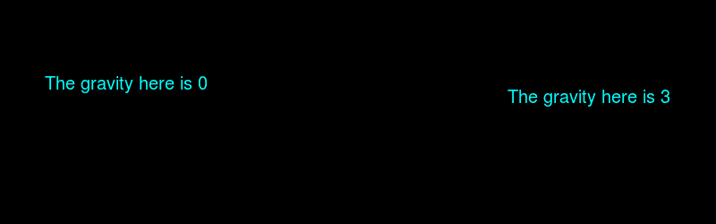

# PHP|ImagickDraw getGravic()函数

> Original: [https://www.geeksforgeeks.org/php-imagickdraw-getgravity-function/](https://www.geeksforgeeks.org/php-imagickdraw-getgravity-function/)

**ImagickDraw：：get 重力()函数**是 PHP 中的一个内置函数，用于获取在注释文本时使用的文本放置重力。

**语法：**

```php
*int* ImagickDraw::getGravity( *void* )
```

**参数：**此函数不接受任何参数。

**返回值：**此函数返回与[重力常数](https://www.php.net/manual/en/imagick.constants.php/#imagick.constants.gravity-northwest)之一相对应的整数值，或在未设置时返回 0。

重力常数列表如下：

*   Imagick：：Grasion_Northwest(1)
*   Imagick：：重力 _ 北(2)
*   想象力：：重力 _ 东北(3)
*   Imagick：：Grasion_West(4)
*   Imagick：：Grasion_Center(5)
*   Imagick：：Grasion_East(6)
*   Imagick：：Grasion_Southwest(7)
*   Imagick：：Grasion_South(8)
*   Imagick：：重力 _ 东南(9)

下面的程序演示了 PHP 中的**ImagickDraw：：get 重力()函数**：

**程序 1：**

```php
<?php

// Create a new ImagickDraw object
$draw = new ImagickDraw();

// Get the font Gravity
$Gravity = $draw->getGravity();
echo $Gravity;
?>
```

发帖主题：Re：Колибри0.7.0

```php
0 // Which is the default value.
```

**程序 2：**

```php
<?php

// Create a new ImagickDraw object
$draw = new ImagickDraw();

// Set the font Gravity
$draw->setGravity(8);

// Get the font Gravity
$Gravity = $draw->getGravity();
echo $Gravity;
?>
```

发帖主题：Re：Колибри0.7.0

```php
8
```

**程序 3：**

```php
<?php

// Create a new imagick object
$imagick = new Imagick();

// Create a image on imagick object
$imagick->newImage(800, 250, 'black');

// Create a new ImagickDraw object
$draw = new ImagickDraw();

// Set the fill color
$draw->setFillColor('cyan');

// Set the font size
$draw->setFontSize(20);

// Annotate a text to (50, 100)
$draw->annotation(50, 100, 
    'The gravity here is ' . $draw->getGravity());

// Set the gravity
$draw->setGravity(3);

// Annotate a text to (50, 100)
$draw->annotation(50, 100, 
    'The gravity here is ' . $draw->getGravity());

// Render the draw commands
$imagick->drawImage($draw);

// Show the output
$imagick->setImageFormat('png');
header("Content-Type: image/png");
echo $imagick->getImageBlob();
?>
```

**输出：**


**引用：**[https://www.php.net/manual/en/imagickdraw.getgravity.php](https://www.php.net/manual/en/imagickdraw.getgravity.php)