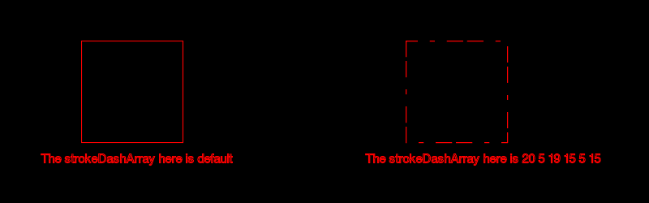

# PHP|ImagickDraw getStrokeDashArray()函数

> Original: [https://www.geeksforgeeks.org/php-imagickdraw-getstrokedasharray-function/](https://www.geeksforgeeks.org/php-imagickdraw-getstrokedasharray-function/)

**ImagickDraw：：getStrokeDashArray()函数**是 PHP 中的一个内置函数，用于获取表示用于描边路径的虚线和间隙模式的数组。

**语法：**

```php
*array* ImagickDraw::getStrokeDashArray( *void* )
```

**参数：**此函数不接受任何参数。

**返回值：**如果成功，此函数将返回包含笔划破折号的数组，如果未设置，则返回空数组。

下面的程序演示了 PHP 中的**ImagickDraw：：getStrokeDashArray()函数**：

**程序 1：**

```php
<?php

// Create a new ImagickDraw object
$draw = new ImagickDraw();

// Get the stroke dash array
$array = $draw->getStrokeDashArray();
print("<pre>".print_r($array, true)."</pre>");
?>
```

发帖主题：Re：Колибри0.7.0

```php
Array // Empty array which is the default value
(
)
```

**程序 2：**

```php
<?php

// Create a new ImagickDraw object
$draw = new ImagickDraw();

// Set the stroke dash array
$draw->setStrokeDashArray([20, 5, 20, 5, 5, 5, ]);

// Get the stroke dash array
$array = $draw->getStrokeDashArray();
print("<pre>".print_r($array, true)."</pre>");
?>
```

发帖主题：Re：Колибри0.7.0

```php
Array
(
    [0] => 20
    [1] => 5
    [2] => 20
    [3] => 5
    [4] => 5
    [5] => 5
)
```

**程序 3：**

```php
<?php

// Create a new ImagickDraw object
$draw = new ImagickDraw();

// Create a new imagick object
$imagick = new Imagick();

// Create a image on imagick object
$imagick->newImage(800, 250, 'black');

// Create a new ImagickDraw object
$draw = new ImagickDraw();

// Set the fill color
$draw->setFillColor('black');

// Set the color of stroke
$draw->setStrokeColor('red');

// Set the font size
$draw->setFontSize(15);

// Draw a rectangle
$draw->rectangle(100, 50, 225, 175);

// Annotate a text
$draw->annotation(50, 200, 'The strokeDashArray here is default');

// Set the stroke dash array
$draw->setStrokeDashArray([20, 5, 19, 15, 5, 15, ]);

// Draw a rectangle
$draw->rectangle(500, 50, 625, 175);

// Get the stroke dash array
$strokeDashArray = $draw->getStrokeDashArray();

// Annotate a text
$draw->annotation(450, 200, 'The strokeDashArray here is ' 
                  . implode(" ", $strokeDashArray));

// Render the draw commands
$imagick->drawImage($draw);

// Show the output
$imagick->setImageFormat('png');
header("Content-Type: image/png");

echo $imagick->getImageBlob();
?>
```

**输出：**


**引用：**[https://www.php.net/manual/en/imagickdraw.getstrokedasharray.php](https://www.php.net/manual/en/imagickdraw.getstrokedasharray.php)