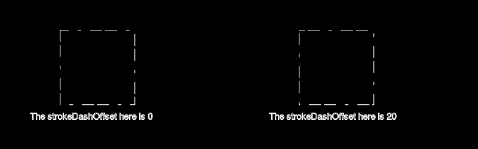

# PHP|ImagickDraw getStrokeDashOffset()函数

> Original: [https://www.geeksforgeeks.org/php-imagickdraw-getstrokedashoffset-function/](https://www.geeksforgeeks.org/php-imagickdraw-getstrokedashoffset-function/)

**ImagickDraw：：getStrokeDashOffset()函数**是 PHP 中的一个内置函数，用于获取划线模式中的偏移量以开始划线。 这个偏移量只是在开始由*setStrokeDashArray()*设置的划线之前要给出的间距。

**语法：**

```
*float* ImagickDraw::getStrokeDashOffset( *void* )
```

**参数：**此函数不接受任何参数。

**返回值：**此函数返回包含偏移量的浮点值。

**异常：**此函数在出错时引发 ImagickException。

下面的程序演示了 PHP 中的**ImagickDraw：：getStrokeDashOffset()函数**：

**程序 1：**

```
<?php

// Create a new ImagickDraw object
$draw = new ImagickDraw();

// Get the stroke dash offset
$offset = $draw->getStrokeDashOffset();
echo $offset;
?>
```

发帖主题：Re：Колибри0.7.0

```
0 // Which is the default value
```

**程序 2：**

```
<?php

// Create a new ImagickDraw object
$draw = new ImagickDraw();

// Set the stroke dash offset
$draw->setStrokeDashOffset(50);

// Get the stroke dash offset
$offset = $draw->getStrokeDashOffset();
echo $offset;
?>
```

发帖主题：Re：Колибри0.7.0

```
50
```

**程序 3：**

```
<?php

// Create a new ImagickDraw object
$draw = new ImagickDraw();

// Create a new imagick object
$imagick = new Imagick();

// Create a image on imagick object
$imagick->newImage(800, 250, 'black');

// Create a new ImagickDraw object
$draw = new ImagickDraw();

// Set the fill color
$draw->setFillColor('black');

// Set the color of stroke
$draw->setStrokeColor('white');

// Set the font size
$draw->setFontSize(15);

 // Set the stroke dash array
$draw->setStrokeDashArray([20, 5, 19, 15, 5, 15]);

// Draw a rectangle
$draw->rectangle(100, 50, 225, 175);

// Annotate a text
$draw->annotation(50, 200, 'The strokeDashOffset here is '
           . $draw->getStrokeDashOffset());

// Set the stroke dash offset
$draw->setStrokeDashOffset(20);

// Draw a rectangle
$draw->rectangle(500, 50, 625, 175);

// Get the stroke dash array
$strokeDashArray = $draw->getStrokeDashArray();

// Annotate a text
$draw->annotation(450, 200, 'The strokeDashOffset here is '
           . $draw->getStrokeDashOffset());

// Render the draw commands
$imagick->drawImage($draw);

// Show the output
$imagick->setImageFormat('png');
header("Content-Type: image/png");
echo $imagick->getImageBlob();
?>
```

**输出：**


**引用：**[https://www.php.net/manual/en/imagickdraw.getstrokedashoffset.php](https://www.php.net/manual/en/imagickdraw.getstrokedashoffset.php)