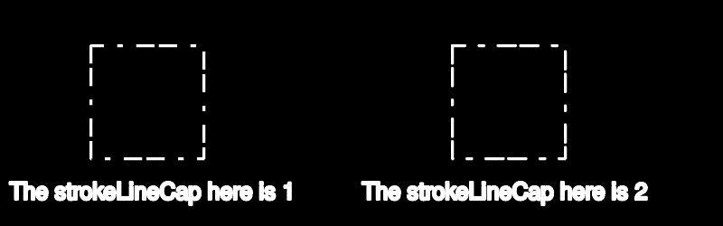

# PHP|ImagickDraw getStrokeLineCap()函数

> Original: [https://www.geeksforgeeks.org/php-imagickdraw-getstrokelinecap-function/](https://www.geeksforgeeks.org/php-imagickdraw-getstrokelinecap-function/)

**ImagickDraw：：getStrokeLineCap()函数**是 PHP 中的一个内置函数，用于在打开的子路径被描边时获取要在其末尾使用的形状。

**语法：**

```php
*int* ImagickDraw::getStrokeLineCap( *void* )
```

**参数：**此函数不接受任何参数。

**返回值：**此函数返回与[LINECAP 常量](https://www.php.net/manual/en/imagick.constants.php/#imagick.constants.linecap-undefined)之一对应的整数值。

LINECAP 常量列表如下：

*   Imagick：：LINECAP_UNDEFINED(0)
*   Imagick：：LINECAP_BUT(1)
*   Imagick：：LINECAP_ROUND(2)
*   Imagick：：LINECAP_Square(3)

**异常：**此函数在出错时引发 ImagickException。

下面的程序演示了 PHP 中的**ImagickDraw：：getStrokeLineCap()函数**：

**程序 1：**

```php
<?php

// Create a new ImagickDraw object
$draw = new ImagickDraw();

// Get the stroke line cap
$lineCap = $draw->getStrokeLineCap();
echo $lineCap;
?>
```

发帖主题：Re：Колибри0.7.0

```php
1 // Which corresponds to imagick::LINECAP_BUTT
```

**程序 2：**

```php
<?php

// Create a new ImagickDraw object
$draw = new ImagickDraw();

// Set the stroke line cap
$draw->setStrokeLineCap(3);

// Get the stroke line cap
$lineCap = $draw->getStrokeLineCap();
echo $lineCap;
?>
```

发帖主题：Re：Колибри0.7.0

```php
3 // Which corresponds to imagick::LINECAP_SQUARE
```

**程序 3：**

```php
<?php

// Create a new ImagickDraw object
$draw = new ImagickDraw();

// Create a new imagick object
$imagick = new Imagick();

// Create a image on imagick object
$imagick->newImage(800, 250, 'black');

// Create a new ImagickDraw object
$draw = new ImagickDraw();

// Set the fill color
$draw->setFillColor('black');

// Set the color of stroke
$draw->setStrokeColor('white');

// Set the stroke width
$draw->setStrokeWidth(3);

// Set the font size
$draw->setFontSize(25);

 // Set the stroke dash array
$draw->setStrokeDashArray([20, 5, 19, 15, 5, 15]);

// Draw a rectangle
$draw->rectangle(100, 50, 225, 175);

// Annotate a text
$draw->annotation(10, 220, 'The strokeLineCap here is '
         . $draw->getStrokeLineCap());

// Set the stroke line cap
$draw->setStrokeLineCap(2);

// Draw a rectangle
$draw->rectangle(500, 50, 625, 175);

// Annotate a text
$draw->annotation(400, 220, 'The strokeLineCap here is '
         . $draw->getStrokeLineCap());

// Render the draw commands
$imagick->drawImage($draw);

// Show the output
$imagick->setImageFormat('png');
header("Content-Type: image/png");
echo $imagick->getImageBlob();
?>
```

**输出：**


**引用：**[https://www.php.net/manual/en/imagickdraw.getstrokelinecap.php](https://www.php.net/manual/en/imagickdraw.getstrokelinecap.php)