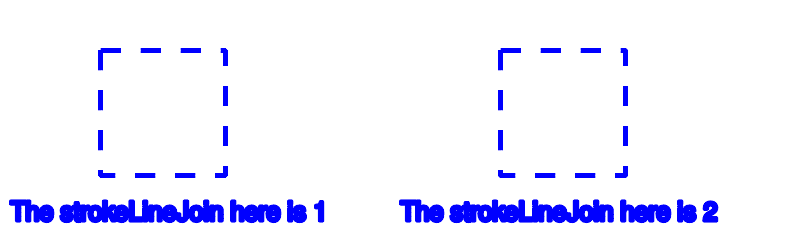

# PHP|ImagickDraw getStrokeLineJoin()函数

> Original: [https://www.geeksforgeeks.org/php-imagickdraw-getstrokelinejoin-function/](https://www.geeksforgeeks.org/php-imagickdraw-getstrokelinejoin-function/)

**ImagickDraw：：getStrokeLineJoin()函数**是 PHP 中的一个内置函数，用于在路径被描边时获取路径拐角处使用的形状。 这通常会影响笔划的外缘和转弯。

**语法：**

```
*int* ImagickDraw::getStrokeLineJoin( *void* )
```

**参数：**此函数不接受任何参数。

**返回值：**此函数返回与[LINEJOIN 常量](https://www.php.net/manual/en/imagick.constants.php/#imagick.constants.linejoin-undefined)之一对应的整数值。

LINEJOIN 常量列表如下：

*   Imagick：：LINEJOIN_ 未定义(0)
*   Imagick：：LINEJOIN_MITER(1)
*   Imagick：：LINEJOIN_ROUND(2)
*   Imagick：：LINEJOIN_BEVELL(3)

**异常：**此函数在出错时引发 ImagickException。

下面的程序演示了 PHP 中的**ImagickDraw：：getStrokeLineJoin()函数**：

**程序 1：**

```
<?php

// Create a new ImagickDraw object
$draw = new ImagickDraw();

// Get the stroke line join
$lineJoin = $draw->getStrokeLineJoin();
echo $lineJoin;
?>
```

发帖主题：Re：Колибри0.7.0

```
1 // Which corresponds to imagick::LINEJOIN_MITER
```

**程序 2：**

```
<?php

// Create a new ImagickDraw object
$draw = new ImagickDraw();

// Set the stroke line join
$draw->setStrokeLineJoin(3);

// Get the stroke line join
$lineJoin = $draw->getStrokeLineJoin();
echo $lineJoin;
?>
```

发帖主题：Re：Колибри0.7.0

```
3 // Which corresponds to imagick::LINEJOIN_BEVEL
```

**程序 3：**

```
<?php

// Create a new ImagickDraw object
$draw = new ImagickDraw();

// Create a new imagick object
$imagick = new Imagick();

// Create a image on imagick object
$imagick->newImage(800, 250, 'white');

// Create a new ImagickDraw object
$draw = new ImagickDraw();

// Set the fill color
$draw->setFillColor('white');

// Set the color of stroke
$draw->setStrokeColor('blue');

// Set the stroke width
$draw->setStrokeWidth(4);

// Set the font size
$draw->setFontSize(25);

 // Set the stroke dash array
$draw->setStrokeDashArray([20]);

// Draw a rectangle
$draw->rectangle(100, 50, 225, 175);

// Annotate a text
$draw->annotation(10, 220, 'The strokeLineJoin here is '
        . $draw->getStrokeLineJoin());

// Set the stroke line join
$draw->setStrokeLineJoin(2);

// Draw a rectangle
$draw->rectangle(500, 50, 625, 175);

// Annotate a text
$draw->annotation(400, 220, 'The strokeLineJoin here is '
        . $draw->getStrokeLineJoin());

// Render the draw commands
$imagick->drawImage($draw);

// Show the output
$imagick->setImageFormat('png');
header("Content-Type: image/png");
echo $imagick->getImageBlob();
?>
```

**输出：**


**引用：**[https://www.php.net/manual/en/imagickdraw.getstrokelinejoin.php](https://www.php.net/manual/en/imagickdraw.getstrokelinejoin.php)