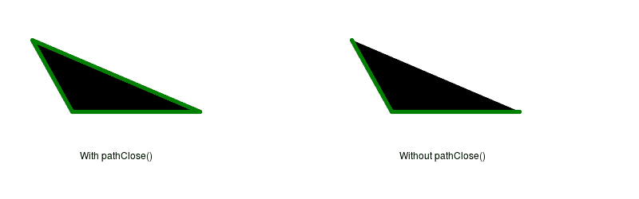

# PHP|ImagickDraw pathClose()函数

> Original: [https://www.geeksforgeeks.org/php-imagickdraw-pathclose-function/](https://www.geeksforgeeks.org/php-imagickdraw-pathclose-function/)

**ImagickDraw：：pathClose()函数**是 PHP 中的一个内置函数，用于向当前路径添加一个 path 元素，该元素通过绘制一条直线来关闭当前子路径。 简而言之，它用于将笔触完全应用于所有边缘。

**语法：**

```
*bool* ImagickDraw::pathClose( *void* )
```

**参数：**此函数不接受任何参数。

**返回值：**如果成功，此函数返回 TRUE。

下面的程序演示了 PHP 中的**ImagickDraw：：pathClose()函数**：

**程序 1：**

```
<?php

// Create a new imagick object
$imagick = new Imagick();

// Create a image on imagick object
$imagick->newImage(800, 250, 'black');

// Create a new ImagickDraw object
$draw = new ImagickDraw();

// Set the stroke color
$draw->setStrokeColor('white');

// Set the stroke width
$draw->setStrokeWidth(5);

// Create a shape with four corners using
// paths with pathClose() function
$draw->pathStart();
$draw->pathMoveToAbsolute(420, 50);
$draw->pathMoveToRelative(20, 0);
$draw->pathLineToRelative(50, 90);
$draw->pathLineToVerticalRelative(30);
$draw->pathLineToHorizontalAbsolute(250);
$draw->pathClose();
$draw->pathFinish();

// Render the draw commands
$imagick->drawImage($draw);

// Show the output
$imagick->setImageFormat('png');
header("Content-Type: image/png");

echo $imagick->getImageBlob();
?>
```

**输出：**


**程序 2：**

```
<?php

// Create a new imagick object
$imagick = new Imagick();

// Create a image on imagick object
$imagick->newImage(800, 250, 'white');

// Create a new ImagickDraw object
$draw = new ImagickDraw();

// Add texts to image
$draw->annotation(100, 200, 'With pathClose()');
$draw->annotation(500, 200, 'Without pathClose()');

// Set the stroke color
$draw->setStrokeColor('green');

// Set the stroke width
$draw->setStrokeWidth(5);

// Create a shape with three coreners using
// paths (with pathClose())
$draw->pathStart();
$draw->pathMoveToAbsolute(20, 50);
$draw->pathMoveToRelative(20, 0);
$draw->pathLineToRelative(50, 90);
$draw->pathLineToVerticalRelative(0);
$draw->pathLineToHorizontalAbsolute(250);
$draw->pathClose();
$draw->pathFinish();

// Create the same shape using
// paths (without pathClose())
$draw->translate(400, 0);
$draw->pathStart();
$draw->pathMoveToAbsolute(20, 50);
$draw->pathMoveToRelative(20, 0);
$draw->pathLineToRelative(50, 90);
$draw->pathLineToVerticalRelative(0);
$draw->pathLineToHorizontalAbsolute(250);
$draw->pathFinish();

// Render the draw commands
$imagick->drawImage($draw);

// Show the output
$imagick->setImageFormat('png');
header("Content-Type: image/png");
echo $imagick->getImageBlob();
?>
```

**输出：**


**引用：**[https://www.php.net/manual/en/imagickdraw.pathclose.php](https://www.php.net/manual/en/imagickdraw.pathclose.php)