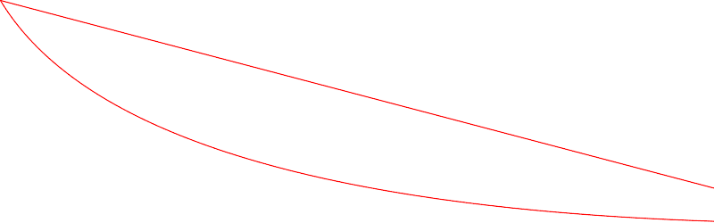
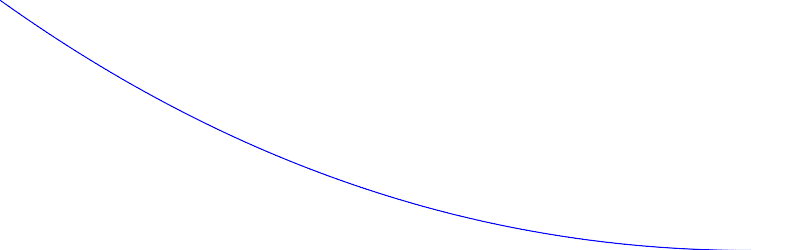

# PHP|ImagickDraw pathCurveToQuadaticBezierAbsolute()函数

> Original: [https://www.geeksforgeeks.org/php-imagickdraw-pathcurvetoquadraticbezierabsolute-function/](https://www.geeksforgeeks.org/php-imagickdraw-pathcurvetoquadraticbezierabsolute-function/)

**ImagickDraw：：pathCurveToQuadraticBezierAbsolute()函数**是 PHP 语言中的一个内置函数，用于绘制一条二次贝塞尔曲线，它只是一条参数二次曲线。

**语法：**

```php
*bool* ImagickDraw::pathCurveToQuadraticBezierAbsolute( *float* $x1, *float* $y1, *float* $x, *float* $y )
```

**参数：**此函数接受上述四个参数，如下所述：

*   **$x1：**指定控制点的 x 坐标。
*   **$y1：**指定控制点的 y 坐标。
*   **$x：**它指定终点的 x 坐标。
*   **$y：**它指定终点的 y 坐标。

**返回值：**如果成功，此函数返回 TRUE。

下面的程序演示了 php 中的**ImagickDraw：：pathCurveToQuadraticBezierAbsolute()函数**：

**程序 1：**

```php
<?php

// Create a new imagick object
$imagick = new Imagick();

// Create a image on imagick object
$imagick->newImage(800, 250, 'white');

// Create a new ImagickDraw object
$draw = new ImagickDraw();

$draw->setFillColor('white');

// Set the stroke color
$draw->setStrokeColor('red');

// Draw curve to Quadratic Bezier Absolute (with pathClose())
$draw->pathStart();
$draw->pathCurveToQuadraticBezierAbsolute(150, 250, 950, 250);
$draw->pathClose();
$draw->pathFinish();

// Render the draw commands
$imagick->drawImage($draw);

// Show the output
$imagick->setImageFormat('png');
header("Content-Type: image/png");
echo $imagick->getImageBlob();
?>
```

**输出：**


**程序 2：**

```php
<?php

// Create a new imagick object
$imagick = new Imagick();

// Create a image on imagick object
$imagick->newImage(800, 250, 'white');

// Create a new ImagickDraw object
$draw = new ImagickDraw();

$draw->setFillColor('white');

// Set the stroke color
$draw->setStrokeColor('blue');

// Draw curve to Quadratic Bezier Absolute (without pathClose())
$draw->pathStart();
$draw->pathCurveToQuadraticBezierAbsolute(350, 250, 750, 250);
$draw->pathFinish();

// Render the draw commands
$imagick->drawImage($draw);

// Show the output
$imagick->setImageFormat('png');
header("Content-Type: image/png");
echo $imagick->getImageBlob();
?>
```

**输出：**


**引用：**[https://www.php.net/manual/en/imagickdraw.pathcurvetoquadraticbezierabsolute.php](https://www.php.net/manual/en/imagickdraw.pathcurvetoquadraticbezierabsolute.php)