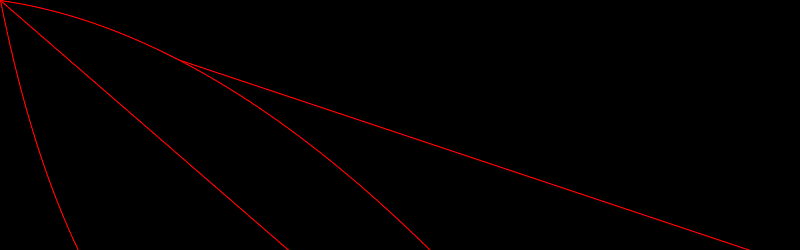

# PHP|ImagickDraw pathCurveToQuadaticBezierRelative()函数

> Original: [https://www.geeksforgeeks.org/php-imagickdraw-pathcurvetoquadraticbezierrelative-function/](https://www.geeksforgeeks.org/php-imagickdraw-pathcurvetoquadraticbezierrelative-function/)

**ImagickDraw：：pathCurveToQuadraticBezierRelative()函数**是 PHP 语言中的一个内置函数，用于绘制一条二次贝塞尔曲线，它只是一条参数二次曲线。 *pathCurveToQuadaticBezierAbsolute()*和*pathCurveToQuadaticBezierRelative()*的唯一区别是后者使用相对控制点，而前者使用绝对点。

**语法：**

```php
*bool* ImagickDraw::pathCurveToQuadraticBezierRelative( *float* $x1,
                         *float* $y1, *float* $x, *float* $y )
```

**参数：**此函数接受上述四个参数，如下所述：

*   **$x1：**指定相对控制点的 x 坐标。
*   **$y1：**指定相对控制点的 y 坐标。
*   **$x：**它指定终点的 x 坐标。
*   **$y：**它指定终点的 y 坐标。

**返回值：**如果成功，此函数返回 TRUE。

下面的程序演示了 php 中的**ImagickDraw：：pathCurveToQuadraticBezierRelative()函数**：

**程序 1：**

```php
<?php

// Create a new imagick object
$imagick = new Imagick();

// Create a image on imagick object
$imagick->newImage(800, 250, 'black');

// Create a new ImagickDraw object
$draw = new ImagickDraw();

$draw->setFillColor('black');

// Set the stroke color
$draw->setStrokeColor('red');

// Draw curves to Quadratic Bezier Relative (with pathClose())
$draw->pathStart();
$draw->pathCurveToQuadraticBezierRelative(150, 750, 750, 250);
$draw->pathClose();
$draw->pathFinish();

$draw->pathStart();
$draw->pathCurveToQuadraticBezierRelative(350, 50, 750, 650);
$draw->pathClose();
$draw->pathFinish();

// Render the draw commands
$imagick->drawImage($draw);

// Show the output
$imagick->setImageFormat('png');
header("Content-Type: image/png");
echo $imagick->getImageBlob();
?>
```

**输出：**


**程序 2：**

```php
<?php

// Create a new imagick object
$imagick = new Imagick();

// Create a image on imagick object
$imagick->newImage(800, 250, 'black');

// Create a new ImagickDraw object
$draw = new ImagickDraw();

$draw->setFillColor('black');

// Set the stroke color
$draw->setStrokeColor('green');

// Draw curves (without pathClose())
$draw->pathStart();
$draw->pathCurveToQuadraticBezierRelative(150, 750, 350, 0);
$draw->pathFinish();

// Render the draw commands
$imagick->drawImage($draw);

// Show the output
$imagick->setImageFormat('png');
header("Content-Type: image/png");
echo $imagick->getImageBlob();
?>
```

**输出：**


**引用：**[https://www.php.net/manual/en/imagickdraw.pathcurvetoquadraticbezierrelative.php](https://www.php.net/manual/en/imagickdraw.pathcurvetoquadraticbezierrelative.php)