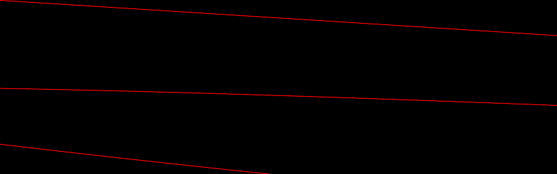
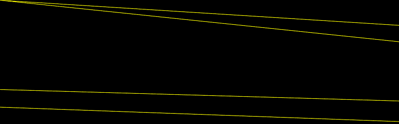

# PHP|ImagickDraw pathCurveToQuadaticBezierSmoothAbsolute()函数

> Original: [https://www.geeksforgeeks.org/php-imagickdraw-pathcurvetoquadraticbeziersmoothabsolute-function/](https://www.geeksforgeeks.org/php-imagickdraw-pathcurvetoquadraticbeziersmoothabsolute-function/)

**ImagickDraw：：pathCurveToQuadraticBezierSmoothAbsolute()函数**是 PHP 语言中的一个内置函数，用于绘制二次贝塞尔曲线，该曲线是一条参数曲线。 此函数可以从二次曲线平滑地延续曲线。

**语法：**

```
*bool* ImagickDraw::pathCurveToQuadraticBezierSmoothAbsolute( *float* $x, *float* $y )
```

**参数：**此函数接受上述两个参数，如下所述：

*   **$x：**它指定结束的 x 坐标
*   **$y：**它指定结束的 y 坐标

**返回值：**如果成功，此函数返回 TRUE。

**异常：**此函数在出错时引发 ImagickException。

下面给出的程序说明了 php 中的**ImagickDraw：：pathCurveToQuadraticBezierSmoothAbsolute()函数**：

**程序 1：**

```
<?php

// Create a new imagick object
$imagick = new Imagick();

// Create a image on imagick object
$imagick->newImage(800, 250, 'black');

// Create a new ImagickDraw object
$draw = new ImagickDraw();

$draw->setFillColor('black');

// Set the stroke color
$draw->setStrokeColor('red');

// Draw curves to Quadratic Bezier Smooth Absolute (without pathClose())
$draw->pathStart();
$draw->pathCurveToQuadraticBezierSmoothAbsolute(3950, 250);
$draw->pathCurveToQuadraticBezierSmoothAbsolute(2950, 250);
$draw->pathCurveToQuadraticBezierSmoothAbsolute(390, 250);
$draw->pathFinish();

// Render the draw commands
$imagick->drawImage($draw);

// Show the output
$imagick->setImageFormat('png');
header("Content-Type: image/png");
echo $imagick->getImageBlob();
?>
```

**输出：**


**程序 2：**

```
<?php

// Create a new imagick object
$imagick = new Imagick();

// Create a image on imagick object
$imagick->newImage(800, 250, 'black');

// Create a new ImagickDraw object
$draw = new ImagickDraw();

$draw->setFillColor('black');

// Set the stroke color
$draw->setStrokeColor('yellow');

// Draw curves to Quadratic Bezier Smooth Absolute (with pathClose())
$draw->pathStart();
$draw->pathCurveToQuadraticBezierSmoothAbsolute(3950, 250);
$draw->pathCurveToQuadraticBezierSmoothAbsolute(950, 250);
$draw->pathCurveToQuadraticBezierSmoothAbsolute(2390, 250);
$draw->pathClose();
$draw->pathFinish();

// Render the draw commands
$imagick->drawImage($draw);

// Show the output
$imagick->setImageFormat('png');
header("Content-Type: image/png");
echo $imagick->getImageBlob();
?>
```

**输出：**


**引用：**[https://www.php.net/manual/en/imagickdraw.pathcurvetoquadraticbeziersmoothabsolute.php](https://www.php.net/manual/en/imagickdraw.pathcurvetoquadraticbeziersmoothabsolute.php)